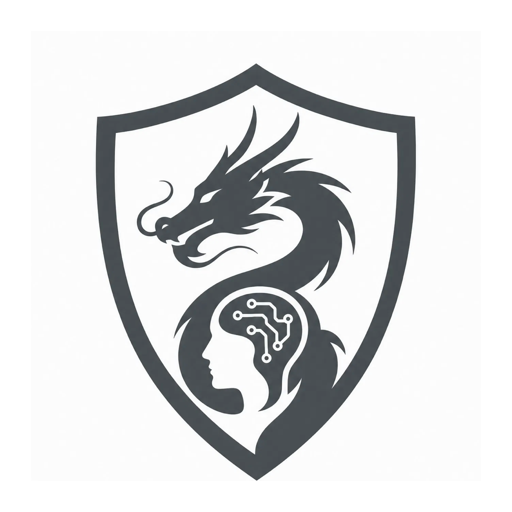
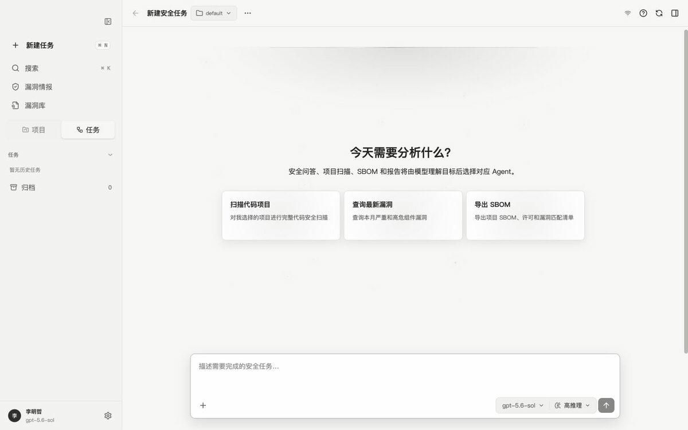
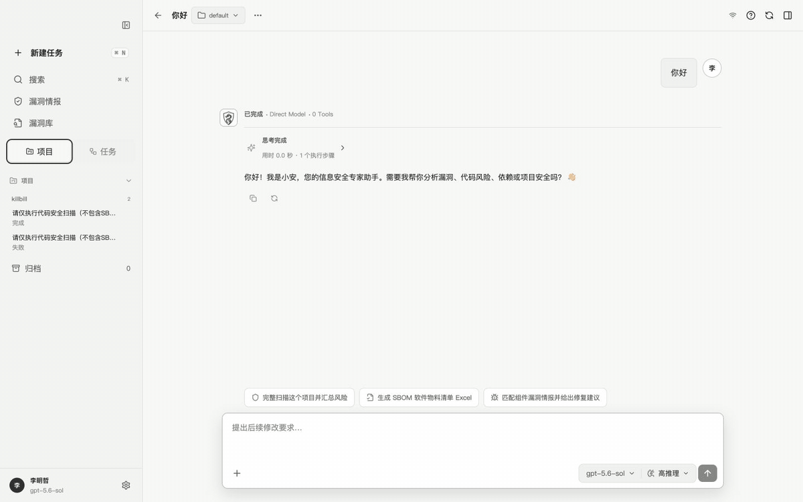
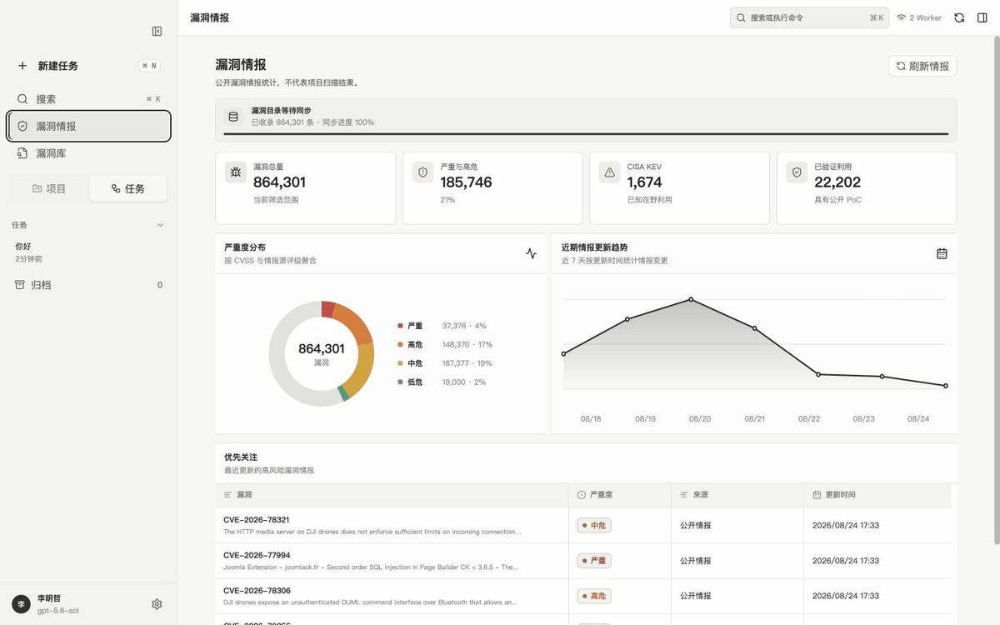
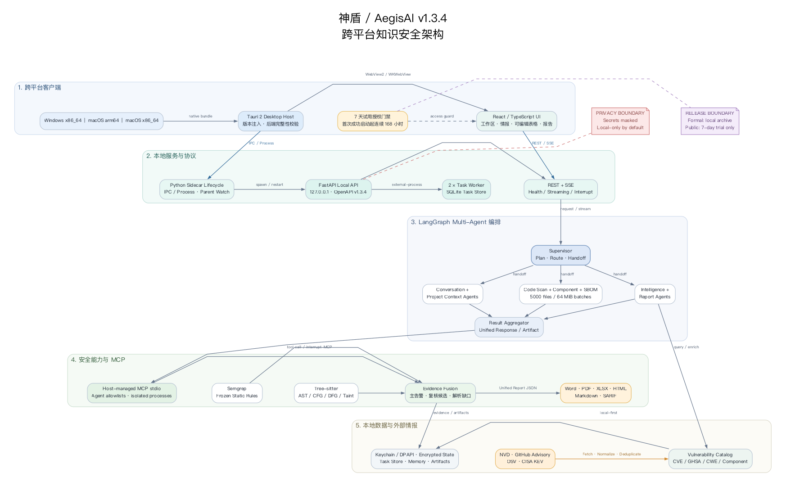
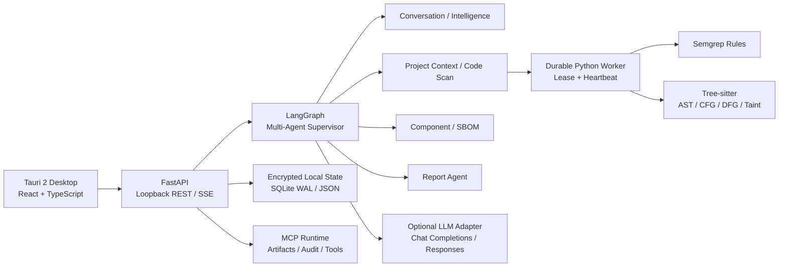

> **扫码进群交流**
>
> 

# AegisAl

<p align="center">
  
</p>

面向安全研发、漏洞知识库与代码审计场景的桌面安全智能体。当前主客户端采用 **Tauri 2 + React/TypeScript**，本地后端采用 **FastAPI + LangGraph + Python Worker**。

> 作者：**ShenSiQi**  
> 许可证：[**AegisAl Source-Available Commercial Non-Redistribution License**](LICENSE)
> 本仓库源码可用于审阅、学习和评估，但未经书面商业授权，不得再分发、转售、SaaS 包装或商用交付。

## 当前版本

源码版本 `v1.3.4` 支持以下桌面构建目标：

> **版本说明：** 本次 macOS 14 天试用客户端是 `1.3.4` 的实际二进制构建，二进制源码提交为 `6e849b92b5b483ff416179115519082c33cc39e4`，构建时工作树为干净状态。

| 平台 | 架构 | 构建入口 |
| --- | --- | --- |
| macOS | Intel `x86_64` | `scripts/build_tauri_macos.sh` |
| macOS | Apple Silicon `arm64` | `scripts/build_tauri_macos.sh` |
| Windows 10/11 | `x86_64` | `scripts/build_tauri_windows.ps1` |

跨平台正式包由 [GitHub Actions](.github/workflows/cross-platform-release-build.yml) 在原生 Intel macOS 和 Windows runner 上构建。桌面包内置本地 API、任务 Worker、Semgrep 规则、Tree-sitter 语义分析依赖和所需许可证文件。

## 本次修复与优化

- 普通问答支持关闭、适中、活跃三档表情策略，本地问候无需调用模型。
- 思考与工具调用采用默认折叠的统一时间线，保留流式与执行动效。
- 漏洞数据以翻译后的全量行列显示，支持搜索、分页、编辑和会话持久化。
- 报告生成增加翻译 Agent 兜底，合并重复下载确认，并支持 Markdown、HTML、Word、PDF、Excel 与 SARIF。
- 信息中心主题与主窗口同步，修复浅色遮挡文字和历史品牌显示。
- 修复模型锁定、第三方 API Key、本机密钥恢复和解密失败覆盖状态问题。
- 大项目扫描采用 5000 文件或 64 MiB 分批，不再按项目总容量拒绝几十 GB 的工作区。
- 问答与项目扫描结果的状态头像统一使用 AegisAl Logo。
- Mermaid 与 DOMPurify 已升级到修复版本，生产前端依赖审计未发现已知漏洞。
- 修复 Intel 构建中原生运行库提示写入 MCP 标准输出、干扰 JSON-RPC 消息解析的问题。

完整变更、试用包边界与校验值见 [v1.3.4 发布说明](docs/RELEASE_NOTES_v1.3.4.md)。

本次发布验证基线：前端 27 个测试文件、200 项测试通过；MCP 与翻译链路 71 项测试及 16 项子测试通过；试用授权与打包版本 12 项测试通过；生产前端依赖审计未发现已知漏洞；TypeScript 检查、Vite 生产构建以及 ARM64/Intel Rust 检查通过。

## 14 天试用版

试用期从首次成功启动起连续计算 336 小时。两个安装包均为 ad-hoc 签名且未进行 Apple 公证；首次打开时可能需要在 macOS“隐私与安全性”中确认。Release 只提供试用版，不提供正式版安装包。

| 平台 | 客户端构建 | 安装包 | SHA-256 |
| --- | --- | --- | --- |
| macOS Apple Silicon (`arm64`) | `1.3.4` | `AegisAl-v1.3.4-macOS-ARM64-Trial-14Days.dmg` | `6ae341e9dcbc4a2a1d302f38131055ad8d4a1bf0bce18731b794ea6da77fd674` |
| macOS Intel (`x86_64`) | `1.3.4` | `AegisAl-v1.3.4-macOS-x86_64-Trial-14Days.dmg` | `01a9a28fb26e9640cfac8c89e4849ee5a6225297631755ba318dc2ac8c4b0b66` |

安装包及对应校验文件见 [v1.3.4 macOS 14 天试用客户端 Release](https://github.com/FuNianTongXue/AegisAl/releases/tag/v1.3.4-trial-14days)。

> **发布调整：** 这是 AegisAl 在 GitHub 的最后一次公开源码更新和公开试用版发布。后续产品更新不再开源，也不再同步至 GitHub；后续试用版仅在微信群发布。本仓库保留为 `v1.3.4` 历史公开快照。

## 功能演示

### 普通问答

表情策略、折叠思考过程、工具调用时间线与 AegisAl 状态 Logo：



### 项目扫描

风险概览、扫描结果与工具执行过程：



### 漏洞情报与漏洞库

漏洞情报总览、完整检索与详情查看：



## 核心功能

| 功能 | 实现 |
| --- | --- |
| 安全问答 | LangGraph 分类、记忆召回、能力路由、模型调用、结构化结果与记忆持久化 |
| Multi-Agent Supervisor | Project Context、Code Scan、Component、SBOM、Intelligence、Report、Conversation Agent 的显式 handoff 与结果聚合 |
| 工作区代码审计 | Java、Python、Go、C、C++、C#、Rust、Solidity 的 Semgrep 与 Tree-sitter AST/CFG/DFG/taint 分析 |
| 漏洞库 | 本地加密目录、CVE/GHSA 聚合、完整 CVE 搜索、严重度筛选、漏洞详情和公开信息跳转 |
| 组件与 SBOM | Maven、Gradle、npm、pip、Go Modules、Cargo、NuGet、Conan、vcpkg 等依赖识别和 CycloneDX 输出 |
| 公开安全资讯 | 聚合公开 RSS/API，缓存、去重、分类、搜索并直接展示源站原文 |
| 报告 | Markdown、Word、PDF、Excel、SARIF、Mermaid 和图表制品 |
| 长期记忆 | 按 `user_id` 本地隔离、摘要压缩、重要性评分和跨会话召回 |
| 插件与 Skills | 内置神盾 Skills、插件注册表、MCP 工具协议、权限与副作用边界 |
| 桌面安全 | 回环 API、加密状态、系统凭证库、路径边界、符号链接隔离、包完整性检查 |

## 架构



架构图提供 [SVG](docs/assets/aegisal-architecture-v1.3.4.svg)、[PNG](docs/assets/aegisal-architecture-v1.3.4.png) 和可审阅的 [Graphviz 源文件](docs/assets/aegisal-architecture-v1.3.4.dot)。完整的组件边界、数据流和安全设计见 [架构文档](docs/ARCHITECTURE.md)。



主要目录：

```text
app/
  agent/                 专业 Agent、契约、任务 Worker、翻译策略
  api/routes/            完整应用与独立问答 API
  langgraph/             Supervisor 与各能力子图
  mcp/                   扫描、组件、SBOM、翻译与报告工具
  plugins/               插件模型、注册表、运行时和权限边界
  resources/skills/      神盾内置 Skills 与 Agent 元数据
  skills/                Skills 加载运行时
config/semgrep/           多语言离线安全规则
desktop/SecFlowTauri/     Tauri 2 + React/TypeScript 桌面客户端
scripts/                  Tauri 打包、验证和安全评测脚本
tests/                    Python 后端与安全回归测试
docs/                     架构、产品、API、许可和 1.3.4 发布资料
```

更完整的边界见 [架构文档](docs/ARCHITECTURE.md)、[产品功能](docs/PRODUCT_FEATURES.md) 和 [API 参考](docs/API_REFERENCE.md)。

## 本地开发

### 后端

```bash
git clone https://github.com/FuNianTongXue/AegisAl.git
cd AegisAl
python -m venv .venv
source .venv/bin/activate
pip install -r requirements.txt
python scripts/fetch_translation_model.py
uvicorn app.api.routes.application:app --reload --host 127.0.0.1 --port 18081
```

- 健康检查：`http://127.0.0.1:18081/health`
- OpenAPI：`http://127.0.0.1:18081/docs`

独立安全问答服务：

```bash
.venv/bin/uvicorn app.assistant_app:app --host 127.0.0.1 --port 18082
```

### Tauri 前端

```bash
cd desktop/SecFlowTauri
corepack enable
pnpm install --frozen-lockfile
pnpm test
pnpm build
```

### 测试

```bash
.venv/bin/python -m pytest -q
PATH=".venv/bin:$PATH" bash scripts/smoke.sh
```

## 正式版打包

### macOS

必须使用与目标一致的 Python 和 Rust 架构。Intel 包应在 `x86_64` runner 或 Intel Mac 上构建：

```bash
SECFLOW_MACOS_ARCH=x86_64 \
PYTHON_BIN=/path/to/x86_64/venv/bin/python \
bash scripts/build_tauri_macos.sh
```

Apple Silicon：

```bash
SECFLOW_MACOS_ARCH=arm64 \
PYTHON_BIN=/path/to/arm64/venv/bin/python \
bash scripts/build_tauri_macos.sh
```

### Windows x86_64

在 Windows PowerShell 中执行：

```powershell
./scripts/build_tauri_windows.ps1 -Edition formal
```

构建脚本会验证后端、Worker、静态分析运行时、翻译资源完整性以及产物架构。CI 正式构建可在 GitHub Actions 中手动运行 `Cross-platform formal desktop build`。

离线翻译模型不直接写入 Git 历史。开发和 CI 使用 `scripts/fetch_translation_model.py`
从清单固定的官方地址下载，并依次校验上游归档和模型文件的 SHA-256；校验通过后才允许打包。

## Agent、Skills 与 MCP

内置 Skills 位于 `app/resources/skills/`：

- `secflow-multi-agent-supervisor`
- `secflow-project-adaptive-scan`
- `secflow-project-scan`
- `secflow-component-vulnerability-catalog`
- `secflow-component-vulnerability-query`
- `secflow-project-sbom`
- `secflow-report-generation`

Supervisor 根据意图和前置制品选择最小能力集合，专业 Agent 通过显式 handoff 交换结构化结果。MCP Runtime 负责工具输入校验、调用审计、制品登记与错误隔离。报告、SBOM 和组件目录等需要用户确认的流程使用 LangGraph interrupt/resume，避免在未确认时生成或覆盖制品。

## 翻译边界

- 安全资讯：不翻译，直接展示源站原文。
- 漏洞目录和漏洞详情：使用随应用分发的本地翻译能力；不要求用户配置 LLM，也不消耗用户模型 Token。
- 技术标识（CVE、GHSA、CWE、组件名、版本、函数名、路径、URL）：保持原样。
- 翻译失败时保留可审计原文，不伪造漏洞事实或版本结论。

## 安全设计

- API 凭证在响应、日志和诊断中脱敏。
- 本地状态与任务记录加密保存，桌面主密钥使用系统凭证库保护。
- 工作区扫描限制读取根目录、符号链接、文件大小与总预算。
- 扫描任务采用 SQLite WAL、租约、心跳和有限重试，防止进程退出造成静默丢失。
- 漏洞版本、修复版本和 CVSS 只接受结构化事实；缺失信息明确标记，不由模型猜测。
- 客户可见回答移除内部集合名、私有检索链路和密钥材料。
- LLM 是可选增强能力；本地目录查询、资讯、静态扫描和制品生成不以用户模型配置为前置条件。

## 许可证

本项目采用 [AegisAl Source-Available Commercial Non-Redistribution License](LICENSE)，第三方声明见 [NOTICE](NOTICE)。GitHub 仓库公开不代表允许再分发或商业使用；生产部署、企业内部非评估用途、SaaS、客户交付、转售及其他商业使用均须获得作者书面商业授权。
