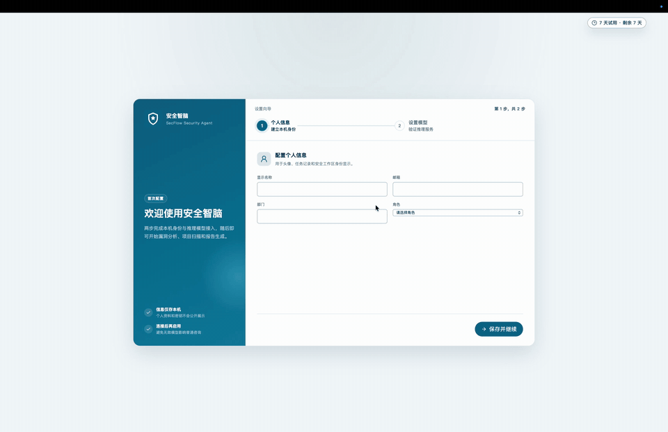
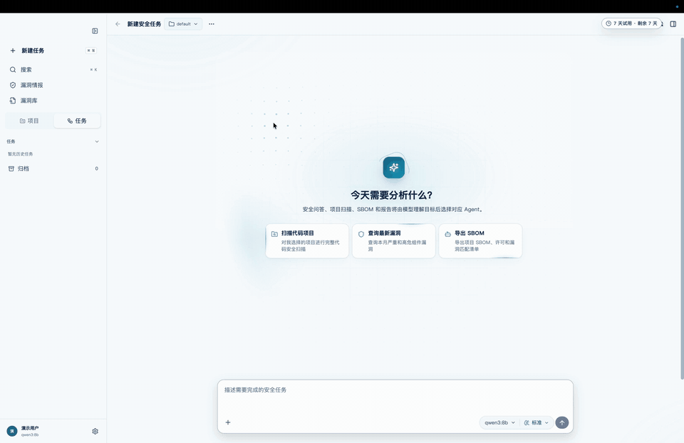
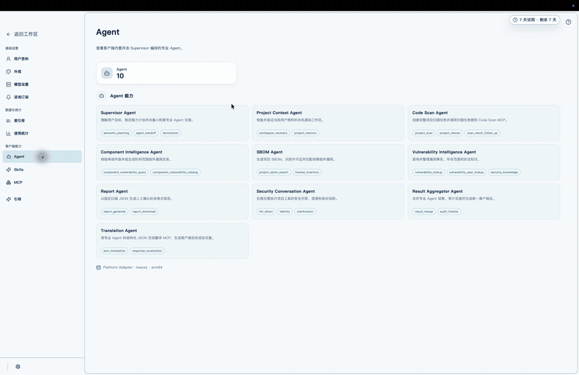
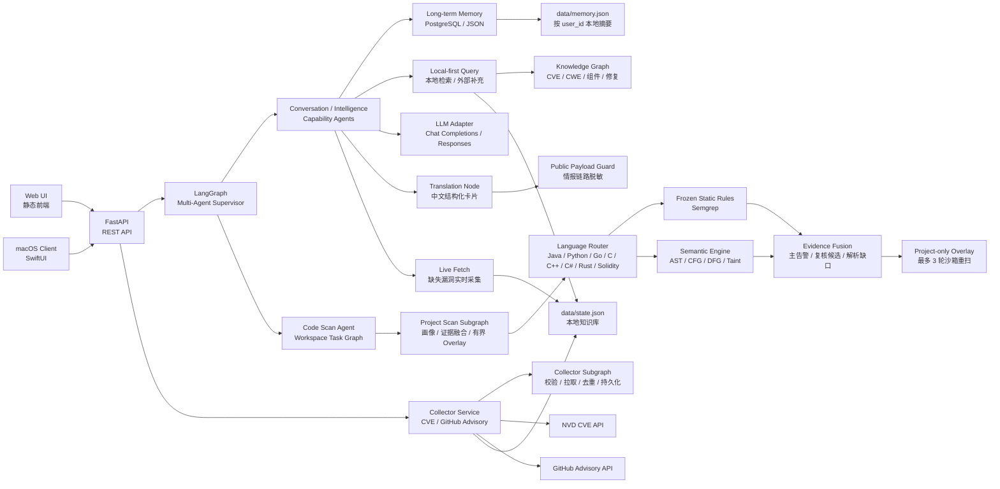

# SecFlow Knowledge Security Assistant

<p align="center">
  <b>面向 AI 安全攻防、漏洞知识库与安全研发场景的轻量级 LangGraph 知识库安全助手</b>
</p>

<p align="center">
  
  
  
  
</p>

> 作者：**ShenSiQi**  
> 许可证：**SecFlow Source-Available Commercial Non-Redistribution License**  
> 说明：本仓库源码公开用于审阅、学习和评估，但不是 OSI 意义上的开源许可证；未经书面商业授权，不允许再分发、转售、SaaS 包装或商用交付。

---

## v1.3.3 跨平台 7 天试用版

当前主客户端为 Tauri 2 + React/TypeScript + Python LangGraph sidecar。v1.3.3 同时提供 Windows x86_64、macOS Apple Silicon 和 macOS Intel 安装包，试用期从首次成功启动起连续计算 7 天：

| 平台 | 7 天试用版 | 适用设备 |
| --- | --- | --- |
| Windows `x86_64` | [下载安装程序](https://github.com/FuNianTongXue/secflow-knowledge-security-assistant/releases/download/v1.3.3-trial-7days/SecFlow-v1.3.3-Windows-x86_64-Trial-7Days-Setup.exe) | Windows 10/11 64 位 |
| macOS `arm64` | [下载 DMG](https://github.com/FuNianTongXue/secflow-knowledge-security-assistant/releases/download/v1.3.3-trial-7days/SecFlow-v1.3.3-macOS-ARM64-Trial-7Days.dmg) | Apple Silicon Mac |
| macOS `x86_64` | [下载 DMG](https://github.com/FuNianTongXue/secflow-knowledge-security-assistant/releases/download/v1.3.3-trial-7days/SecFlow-v1.3.3-macOS-x86_64-Trial-7Days.dmg) | Intel Mac |

正式版与试用版使用不同应用标识和本地端口，可以并存。GitHub Release 仅提供 7 天试用版；无限期正式版不上传公开仓库。Windows 试用版已在 Parallels Desktop 的 Windows 11 中完成安装、首次引导、健康检查、双 Worker 和父进程退出验收。完整变更见 [v1.3.3 发行说明](docs/RELEASE_NOTES_v1.3.3.md)，安装包校验值见 [SHA-256 清单](docs/RELEASE_CHECKSUMS_v1.3.3.md)。

### 功能演示

| 首次配置 | 工作区、漏洞情报与漏洞库 | Agent、Skills 与 MCP |
| --- | --- | --- |
|  |  |  |

### 源码架构


详细边界见 [架构文档](docs/ARCHITECTURE.md)、[产品功能文档](docs/PRODUCT_FEATURES.md) 与 [API 接口文档](docs/API_REFERENCE.md)。机器可读 OpenAPI 位于 [docs/openapi.json](docs/openapi.json)。

## 历史 macOS 双架构试用版

> 第三阶段主客户端已迁移到 `desktop/SecFlowTauri`，采用 Tauri 2 + React/TypeScript + Python LangGraph sidecar。下面的 v1.2.0 SwiftUI 试用包继续保留作为已发布兼容版本；第三阶段架构、真实 21st.dev 收藏映射、ZCode 能力取舍和构建验证见 [docs/TAURI_PHASE3.md](docs/TAURI_PHASE3.md)。

macOS 智能体模块已经从 SecFlow AI 平台中独立发布，源码与构建入口均位于本仓库 `main` 分支。版本 `v1.2.0` 提供 Apple Silicon 和 Intel Mac 两个三天试用包，首次启动后连续可用 72 小时：

| 平台 | 下载 | 适用设备 |
| --- | --- | --- |
| Apple Silicon `arm64` | [SecFlow-Trial-3Days-macOS-arm64.zip](https://github.com/FuNianTongXue/secflow-knowledge-security-assistant/releases/download/v1.2.0-macos-agent-trial/SecFlow-Trial-3Days-macOS-arm64.zip) | M1 / M2 / M3 / M4 系列 Mac |
| Intel `x86_64` | [SecFlow-Trial-3Days-macOS-x86_64.zip](https://github.com/FuNianTongXue/secflow-knowledge-security-assistant/releases/download/v1.2.0-macos-agent-trial/SecFlow-Trial-3Days-macOS-x86_64.zip) | Intel Mac，也可在 Rosetta 下运行 |

客户端最低支持 macOS 14。发布包采用 ad-hoc 签名，未经过 Apple Developer ID 公证；在其他 Mac 首次打开时，可能需要在 Finder 中右键选择“打开”。完整校验值、变更记录和许可证说明见 [GitHub Release](https://github.com/FuNianTongXue/secflow-knowledge-security-assistant/releases/tag/v1.2.0-macos-agent-trial)。

### 独立模块边界

| 模块 | 目录 | 内容 |
| --- | --- | --- |
| macOS 前端 | `macos/SecFlowMac/Sources/SecFlowMac` | SwiftUI 登录、总览、智能问答、资讯、知识图谱、漏洞库、报告和设置界面 |
| 第三阶段桌面前端 | `desktop/SecFlowTauri` | Tauri 2 + React/TypeScript，覆盖智能问答、项目任务、情报、归档、设置和报告确认 |
| 智能体后端 | `app/` | FastAPI API、LangGraph 编排、长期记忆、情报查询、依赖分析、代码审计和报告生成 |
| 静态分析规则 | `config/semgrep/` | Java、Python、Go、C/C++、Rust、Solidity 离线规则 |
| 桌面打包 | `scripts/build_tauri_macos.sh`、`scripts/build_tauri_macos_trial.sh` | 内嵌后端、Semgrep、Tree-sitter 语法模块、许可证、完整性校验与签名验证 |

试用状态在后端统一校验，界面倒计时不是授权依据。到期、检测到系统时间回拨或状态损坏后，原生界面会锁定，核心 `/api` 请求返回 `403`。状态使用加密文件与 macOS Keychain 双副本保存；离线限时无法做到绝对不可破解，但删除单一副本或普通卸载重装不会重置试用期。

## 项目定位

SecFlow Knowledge Security Assistant 是从 SecFlow AI 平台中抽取出的精简版知识库安全助手。它使用 LangGraph 组织安全问答流程，通过 FastAPI 提供后端服务，通过轻量前端完成漏洞情报采集配置，并支持长期记忆、跨会话上下文召回、中文结构化漏洞卡片、版本事实约束、客户可见信息脱敏和 OpenAI-compatible LLM 调用诊断。

### 独立智能问答服务

当前源码将智能问答进一步拆成可独立启动的 FastAPI 应用。该入口只暴露问答、SSE 流式输出、LangGraph 图定义、组件/SBOM/报告 Interrupt、助手制品与会话归档接口，不加载扫描任务、订阅或管理页面路由：

```bash
.venv/bin/uvicorn app.assistant_app:app \
  --host 127.0.0.1 \
  --port 18082
```

启动后访问 `http://127.0.0.1:18082/docs` 查看独立 OpenAPI。完整客户端继续使用 `uvicorn app.main:app`，现有 API 保持兼容。

| 独立层 | 路径 | 职责 |
| --- | --- | --- |
| 应用入口 | `app/assistant_app.py` | 独立 FastAPI 生命周期、健康检查和 OpenAPI |
| API 路由 | `app/api/routes/assistant.py` | 问答、SSE、Interrupt、制品和会话接口 |
| Agent 服务 | `app/agent/assistant_service.py` | Multi-Agent 问答调用、流式分片和 Interrupt 恢复协议 |
| Supervisor | `app/langgraph/multi_agent_graph.py` | 专业 Agent 规划、显式 handoff、结果聚合和隔离策略 |
| 能力子图 | `app/langgraph/assistant_graph.py` | 检索、组件/SBOM/报告子图、LLM 与记忆编排 |
| MCP | `app/mcp/` | 独立代码扫描 SSE、结构化 JSON 翻译、组件、SBOM、图表、Markdown、Word、PDF 工具 |

独立部署说明、接口清单和验证命令见 [智能问答独立模块文档](docs/ASSISTANT_MODULE.md)。

默认情况下，它只用本地加密状态文件运行：采集配置与漏洞情报保存在 `data/state.json`，每个 `user_id` 的问答历史和压缩摘要保存在 `data/memory.json`。模型层支持 Chat Completions，并内置 Sub2API Responses API 配置：`gpt-5.6-sol`、`xhigh` 推理强度和 `store: false`。

它适合用于：

- AI 安全问答原型验证
- CVE / GHSA 漏洞知识库采集配置演示
- LangGraph 安全 Agent 工作流学习
- 安全研发平台的知识库助手雏形
- 内部安全工具 PoC 与轻量部署

## 核心特性

| 能力 | 说明 |
| --- | --- |
| LangGraph 安全问答 | 按 `分类 -> 记忆召回 -> 条件检索 -> 模型回答 -> 记忆持久化` 组织节点流程 |
| Multi-Agent Supervisor | 在 Project Context、Code Scan、Component、SBOM、Intelligence、Report 和 Conversation Agent 间执行最小权限 handoff，并由 Result Aggregator 统一输出 |
| 独立问答服务 | 可单独启动 `app.assistant_app:app`，不携带扫描任务、订阅和平台管理路由 |
| 工作区任务智能体 | 在 macOS 客户端选择项目目录后，自动识别 Java、Python、Go、C、C++、C#、Rust、Solidity，并路由到各语言专属 Semgrep 与 Tree-sitter AST/CFG/DFG 节点 |
| 状态一致性门禁 | 历史扫描心跳在节点完成后自动折叠；只有结果、计划步骤和完成事件同时终态时才开放报告生成 |
| CVE 采集配置 | 支持 NVD API URL、API Key、严重等级、集合名、最大采集量等配置 |
| GitHub Advisory 配置 | 支持 GitHub Advisory API、Token、生态过滤、严重等级、集合名等配置 |
| 本地知识库 | 使用加密 SQLite catalog 存储聚合漏洞记录；标题和描述在入库前批量翻译为简体中文，同时保留上游原文用于审计和英文输出 |
| 长期记忆 | 按 `user_id` 本地持久化问答和项目提交，自动压缩摘要、重要性评分和跨会话召回 |
| 情报查询与富化 | 查询本地情报库并并发补充 NVD、GitHub Advisory、OSV，按别名归并、入库前翻译后写回本地；中文查询直接复用已存译文 |
| 信息咨询 | 聚合 FreeBuf、阿里先知、腾讯安全、腾讯玄武、CISA、Microsoft、Cisco Talos、PortSwigger 和 SANS ISC 等无需密钥且可直连的公开端点，支持缓存、去重、分类、搜索和来源订阅 |
| 订阅管理 | macOS 设置页提供当前订阅、月/季/年套餐、支付方式、用量与订单记录；后端提供服务端定价、幂等订单、签名回调和取消续费接口 |
| 知识图谱 | 从 CVE/GHSA、CWE、组件、影响版本和修复版本生成可交互节点与关系 |
| LLM 适配 | 支持 OpenAI-compatible Chat Completions 与 Responses API；macOS 设置页内置 Sub2API / GPT-5.6 Sol |
| 智能路由 | CVE / GHSA 编号问题优先走漏洞 RAG；带年份的漏洞/CVE/高危/最新问题会先查本地 RAG 并调用 CVE 接口补充最新记录 |
| 中文卡片子节点 | 独立 LangGraph 节点将漏洞事实整理为中文卡片，固定输出编号、名称、描述、CVSS、严重等级、涉及版本、修复版本、修复方案、缓释措施和代码片段 |
| 版本事实保护 | 通配符不会被解释为“所有版本”；修复版本只接受结构化事实，缺失时明确显示“未明确” |
| 情报链路保护 | 问答响应不返回来源名称、来源 URL、内部集合名、检索链路或参考链接，历史记忆同样保存脱敏后的结果 |
| 中文严重等级 | 严重、高危、中危、低危分别使用红、黄、绿、蓝状态标签展示 |
| 前端控制台 | 单页静态前端，支持问答、采集配置、测试连接、执行采集、查看 Trace |
| macOS 客户端 | 原生 SwiftUI 客户端，按安全智脑设计稿提供总览、问答、情报采集、知识图谱、漏洞库与查询源配置 |
| 采集器子图 | 按 `配置校验 -> 拉取 -> 规范化去重 -> 持久化 -> 结果汇总` 独立编排，供手动采集与问答补采复用 |
| 密钥脱敏 | API 响应中自动隐藏 NVD API Key 与 GitHub Token |
| 凭证启用门禁 | CVE API Key 或 GitHub Token 必须先填写并保存，随后才允许测试连接或采集 |
| 低依赖部署 | 未配置数据库或 LLM 时自动退化为 JSON 记忆与本地专家建议 |

## 架构设计



### LangGraph 节点

```text
classify_query
  -> load_memory_context
    -> query_intelligence       # 本地情报优先，并发查询外部接口后写回
      -> enrich_knowledge_graph # 关联 CVE/GHSA、CWE、组件与修复版本
        -> call_llm
          -> translate_vulnerability_card
            -> compose_answer
              -> persist_memory      # 情报库已有入库译文时直接输出
              -> translation_agent   # 非情报回答/目标非中文时处理最终 JSON
                -> persist_memory
```

| 节点 | 作用 |
| --- | --- |
| `classify_query` | 判断用户问题属于 CVE / GHSA 查询、年份漏洞查询、供应链安全、合规或通用安全知识 |
| `load_memory_context` | 读取用户长期记忆，完成历史召回、摘要压缩和上下文拼接 |
| `query_intelligence` | 本地优先查询 CVE / GHSA，并发补充外部结果、别名归并和本地写回 |
| `enrich_knowledge_graph` | 生成漏洞、公告、CWE、组件、影响范围和修复版本之间的图关系 |
| `call_llm` | 调用 OpenAI-compatible 模型，并返回真实错误诊断 |
| `translate_vulnerability_card` | 将漏洞事实和分析结果翻译整理为严格中文字段，并校验涉及版本与修复版本不被模型改写或猜测 |
| `compose_answer` | 汇总检索结果、模型输出、执行 Trace 与置信度，返回结构化答案 |
| `translation_agent` | 仅在回答未复用情报库入库译文或目标语言非简体中文时，调用 Translation MCP 翻译用户可见 JSON；代码、路径、版本、URL、漏洞编号和哈希保持原值 |
| `persist_memory` | 将脱敏后的本轮问答写入长期记忆，并更新用户画像摘要 |

### 工作区任务执行图

macOS 客户端将任务执行直接集成在智能问答页面中。用户可通过输入框旁的文件夹入口选择或拖入项目目录与代码文件；拖入代码文件时使用其所在目录作为工作区，再将输入内容作为任务目标提交。左侧“项目”同时管理扫描项目和“智能问答”历史对话；对话切换后会恢复完整问答，右键可归档、恢复或在确认后永久删除。扫描任务同样支持归档、恢复和对终态任务二次确认后永久删除。执行计划、语言规则、AST/CFG/DFG/污点指标与风险结果会作为智能体回复显示在当前对话流中。任务只读取用户明确选择的工作区；普通上传会生成完整的受支持生产源码与依赖清单，再进入项目自适应扫描子图：

普通问答同样以 Security Agent 形式展示：后端通过 SSE 推送真实 LangGraph trace；漏洞情报在写入 catalog 前已批量翻译，中文情报问答直接复用已存译文，其他回答再交给 Translation Agent 与 Translation MCP，最后以无损分片返回目标语言正文。客户端显示可展开时间线、高层 Thinking、默认折叠的 Tool Call 与 Sources、Skeleton 和流式正文；信息中心咨询默认折叠思考过程，仍允许用户手动展开。供应商 reasoning/thinking 字段不会传输。安全回答按已有事实选择摘要、影响、利用条件、风险、修复和来源章节，不输出空模板，也不展示私有推理、内部接口或攻击性 PoC。

```text
inspect_workspace
  -> detect_languages
    -> plan_task
      -> project_scan_subgraph
        -> scan_dependencies
          -> SBOM Agent / identify_project_licenses (license-only capability)
            -> profile_project
            -> dispatch_language
              -> scan_java | scan_python | scan_go | scan_c | scan_cpp | scan_csharp | scan_rust | scan_solidity
                -> fuse_analysis_evidence
                  -> synthesize_project_overlay
                    -> rescan_project_overlay (最多 3 轮，证据不足则跳过)
                      -> verify_results
                        -> compose_result
```

| 项目语言 | Semgrep 规则 | 语义分析 |
| --- | --- | --- |
| Java | `java-security.yml` | Tree-sitter AST/CFG/DFG + 跨方法传播 |
| Python | `python-security.yml` | Tree-sitter AST/CFG/DFG |
| Go | `go-security.yml`、`go-security-recall.yml` | Tree-sitter AST/CFG/DFG + Go 语义增强 |
| C / C++ | `c-cpp-security.yml` | Tree-sitter AST/CFG/DFG + 宏/条件编译候选树 + C++/CUDA grammar fallback |
| Rust | `rust-security.yml` | Tree-sitter AST/CFG/DFG |
| Solidity | `solidity-security.yml` | Tree-sitter AST/CFG/DFG |

提交项目时会把项目名称、任务编号、目标和会话写入当前 `user_id` 的长期记忆。许可识别显式交接给 SBOM Agent，并使用只允许 `identify_project_licenses` 的能力令牌；Code Scan Agent 的令牌只允许 `scan_language`。两者均通过动态 loopback SSE 子进程返回带 PID、耗时和输入/输出 SHA-256 的结构化结果。SBOM 操作还会保存用户隔离的结果快照，因此“存在哪些漏洞”等追问可只读恢复结果且不会消费原下载确认。报告先将扫描事实固化为 canonical JSON 和 SARIF 2.1.0，再由 Mermaid MCP 按 thread flow 完整生成源码及 JPEG；HTML、DOCX 与 PDF 从同一 JSON 嵌入哈希一致的图片，渲染失败不会退回原始 state 或关系 JSON。全部格式归档同时保留 canonical JSON 与 SARIF JSON。

500 项目评测和其他 `evaluation-*` 任务强制使用 `frozen_evaluation`：不调用模型、不应用 Overlay、不把密封标签放入提示词，并保留原有 300 文件、500 KB 单文件、6 MB 总读取量、Semgrep 超时和 Java 18 秒保护配置。项目上传自适应结果与可复现评测、真值集、失败归因和回归门禁保持隔离。

任务过程支持持久队列、实时事件、停止、失败或中断后重试。FastAPI 只负责入队和状态控制，独立 Python Worker 通过 SQLite 租约与心跳运行 LangGraph；Worker 崩溃后自动重启并在租约过期后恢复，最多三次。归档只调整任务记录分组，不删除已生成报告；永久删除只允许终态任务，并从加密任务、事件和队列中级联移除对应记录。扫描器不跟随符号链接，排除测试、依赖缓存和构建产物目录。普通上传不再应用文件数量、单文件大小、总读取量和 18 秒 Java 跨方法保护上限，但始终支持用户取消；冻结评测继续使用原有限制以保持指标可比。当前执行器是只读的安全审计智能体，不运行任意项目命令，也不直接修改工作区源码。

## 目录结构

```text
.
├── app
│   ├── agent
│   │   ├── assistant_intent.py      # LLM 语义能力规划、日期与筛选校验
│   │   ├── project_adaptive_scan.py # 上传项目画像、证据融合、受限 Overlay 与提示词
│   │   ├── task_agent.py            # 工作区任务图、语言路由、取消与恢复
│   │   ├── task_store.py            # 加密任务、追加事件、持久队列与租约
│   │   └── task_worker.py           # 独立 Worker、心跳、恢复与进程监管
│   ├── api
│   │   └── routes
│   │       └── application.py       # FastAPI 应用、中间件与 API 路由
│   ├── langgraph
│   │   ├── assistant_graph.py       # 智能问答主图
│   │   ├── collector_graph.py       # 漏洞采集子图
│   │   ├── component_catalog_graph.py # 时间范围组件漏洞目录与 Excel interrupt
│   │   ├── component_query_graph.py # 组件查询子图
│   │   ├── report_graph.py          # 报告与 interrupt 子图
│   │   └── sbom_graph.py            # 项目 SBOM、漏洞匹配与三阶段 interrupt
│   ├── mcp
│   │   ├── code_scan.py            # 独立代码扫描 MCP SSE Server
│   │   ├── code_scan_client.py     # SSE 子进程生命周期、取消与审计
│   │   ├── component_query.py       # Excel 与 D3 Sankey MCP
│   │   ├── translation.py           # 结构化 JSON Translation MCP
│   │   ├── report_charts.py         # 报告图表 MCP
│   │   ├── report_sarif.py          # SARIF 2.1.0 污点路径 MCP
│   │   ├── report_mermaid.py        # Mermaid 报告图 MCP
│   │   ├── report_markdown.py       # Markdown 报告 MCP
│   │   ├── report_word.py           # Word DOCX 报告 MCP
│   │   ├── report_pdf.py            # PDF 报告 MCP
│   │   └── sbom.py                  # SBOM Excel MCP 与制品存储
│   ├── sbom.py            # CycloneDX JSON 与组件漏洞匹配
│   ├── collectors.py      # CVE / GitHub Advisory 采集、测试、配置保存
│   ├── llm.py             # Chat Completions / Responses LLM 适配与诊断
│   ├── intelligence.py    # 本地优先查询、多源归并和知识图谱富化
│   ├── memory.py          # 按 user_id 本地 JSON 长期记忆服务
│   ├── models.py          # Pydantic 请求与响应模型
│   ├── privacy.py         # 客户可见问答脱敏与中文严重等级
│   ├── storage.py         # 本地 JSON 状态存储与密钥脱敏
│   ├── main.py            # 旧 FastAPI 导入路径兼容别名
│   ├── graph.py           # 旧主图导入路径兼容别名
│   └── static
│       ├── index.html     # 前端页面
│       ├── app.css        # 前端样式
│       └── app.js         # 前端交互逻辑
├── scripts
│   ├── smoke.sh           # 最小可用性测试
│   └── build_macos_app.sh # 构建并签名 SecFlow.app
├── macos
│   └── SecFlowMac         # 原生 SwiftUI macOS 客户端
├── tests
│   └── test_privacy.py    # 来源保护、版本事实和严重等级测试
├── Dockerfile             # 容器镜像构建
├── docker-compose.yml     # 单服务部署示例
├── requirements.txt       # Python 依赖
├── LICENSE                # 商业不可再分发源码许可证
└── README.md
```

## 快速开始

### 方式一：本地 Python 启动

```bash
git clone https://github.com/FuNianTongXue/secflow-knowledge-security-assistant.git
cd secflow-knowledge-security-assistant

python -m venv .venv
source .venv/bin/activate
pip install -r requirements.txt

uvicorn app.api.routes.application:app --reload --host 0.0.0.0 --port 18081
```

访问：

```text
http://127.0.0.1:18081
```

### 方式二：Docker Compose 启动

```bash
git clone https://github.com/FuNianTongXue/secflow-knowledge-security-assistant.git
cd secflow-knowledge-security-assistant

docker compose up -d --build
```

访问：

```text
http://127.0.0.1:18081
```

停止服务：

```bash
docker compose down
```

### 方式三：生产环境 Uvicorn

```bash
SECFLOW_DATA_DIR=/opt/secflow-knowledge/data \
uvicorn app.api.routes.application:app --host 0.0.0.0 --port 18081 --workers 2
```

建议在生产环境前面增加 Nginx / Caddy / Ingress，并将 `data/` 挂载为持久化目录。

### 方式四：macOS 原生智能体客户端

当前 Tauri 2 正式版与 7 天试用版分别使用以下命令构建：

```bash
bash scripts/build_tauri_macos.sh
bash scripts/build_tauri_macos_trial.sh
```

试用版使用独立 Bundle ID、本地端口、数据目录和 Keychain 服务；首次启动开始连续计算 168 小时。试用状态被修改、时间回拨或包内后端完整性校验失败时，应用会安全地停止核心功能或拒绝启动，不会破坏应用文件和用户数据。

开发运行可连接单独启动的后端：

```bash
SECFLOW_SERVER_URL=http://127.0.0.1:18081 swift run --package-path macos/SecFlowMac
```

构建包含本地后端、可直接打开的独立应用包：

```bash
.venv/bin/python -m pip install -r requirements-macos.txt
bash scripts/build_macos_app.sh
open dist/SecFlow.app
```

构建 Apple Silicon 7 天试用版：

```bash
bash scripts/build_macos_trial_app.sh
```

构建 Intel 7 天试用版时，`PYTHON_BIN` 必须指向 x86_64 Python 及其依赖环境：

```bash
SECFLOW_MACOS_ARCH=x86_64 \
PYTHON_BIN=/path/to/x86_64/venv/bin/python \
bash scripts/build_macos_trial_app.sh
```

两个产物分别写入 `dist-macos-trial/SecFlow-Trial-7Days-macOS-arm64.zip` 和 `dist-macos-trial/SecFlow-Trial-7Days-macOS-x86_64.zip`，互不覆盖。上方 `v1.2.0` 下载链接仍是已经发布的历史三天试用包；当前源码构建脚本使用独立标识和数据目录生成 7 天试用包，不会重置或覆盖旧试用状态。

客户端最低支持 macOS 14。发布版不连接现有容器服务，应用会管理自己的回环后端，并将全部运行数据写入 `~/Library/Application Support/SecFlow`。

macOS 发布包内置离线多语言静态分析 CLI、SecFlow 安全规则和 Tree-sitter AST/CFG/DFG 分析运行库，支持 Java、Python、Go、C、C++、C#、Rust 与 Solidity，客户无需安装扫描工具。Java 路径分析支持跨方法传播；新增语言输出文件内结构化 CFG、赋值级 DFG，并与 Semgrep source→sink taint 路径合并。构建脚本会验证真实 CLI、全部离线规则、八种语法模块和 taint 扫描结果，并随应用保留 LGPL-2.1、MIT 许可证与第三方声明；详见 [macOS 构建说明](macos/SecFlowMac/README.md)。

Go 项目会在静态规则和 AST/CFG/DFG 扫描前优先解析 `go.mod`。依赖版本以同模块目录的 `go.mod require` 为准，`go.sum` 仅在缺少同目录 `go.mod` 时作为回退；源码子包 import 会按最长模块前缀归并，当前项目自身模块不会被误报为第三方依赖。

Python 项目会在静态规则和 AST/CFG/DFG 扫描前优先解析 `requirements.txt`（同时支持 `requirements-*.txt` 和 `requirements/*.txt`）。同目录的 `pyproject.toml`、`Pipfile`、`poetry.lock` 和源码 import 只补充 requirements 中未声明的组件，重复组件的版本以 requirements 清单为准。

C# 项目支持 `.csproj`、`Directory.Packages.props`、`packages.config`、`packages.lock.json` 与 `project.assets.json`。组件版本优先采用同项目锁文件的 `resolved` 值，其次使用 `PackageReference` 的 `VersionOverride`/`Version`，最后回退到最近父目录的集中版本定义。

C/C++ 项目从 `CMakeLists.txt`、`conanfile.txt`、`conanfile.py` 和 `vcpkg.json` 提取组件；扫描预算优先保留翻译单元，再处理头文件。解析器保留原始 Tree-sitter 结果，并仅在原始解析失败时尝试保持坐标的宏/条件编译视图、C++ fallback 和按内容启用的 CUDA grammar。明确的第三方 vendored 源码、文档示例、脚手架模板和生成目录不进入项目生产代码告警口径。

低证明强度的危险 API、Rust `unsafe` 块等审计线索保留在“待人工复核”，不计入已确认主风险；Go recall 规则仍保留在召回通道，避免通过简单隐藏低置信规则换取表面误报率。

OWASP BenchmarkJava 与高星 Java 项目的性能及误报/漏报评估见 [Java 自动化代码审计评估](docs/semgrep-java-audit-evaluation-2026-07-17.md)。

100 个随机高星 Go 项目的 OWASP 基线结果、多语言带标签烟测和统计限制见 [多语言静态分析与 Go 基线评估](docs/multilang-static-analysis-and-go-evaluation-2026-07-21.md)。

随机 598 个外部 Go 正例与 598 个反例的冻结资格评测见 [Go 外部语料 598×2 资格评测](docs/go-external-598x2-qualification-2026-07-22.md)。

资格集揭盲后的召回优先规则与 Go 语义层开发回归见 [Go 召回优先优化开发回归](docs/go-recall-optimization-2026-07-21.md)。

## 环境变量

| 变量 | 默认值 | 说明 |
| --- | --- | --- |
| `SECFLOW_DATA_DIR` | `data` | 运行态配置和知识库记录存储目录 |
| `DATABASE_URL` / `POSTGRES_DSN` | 空 | PostgreSQL 长期记忆连接串；为空时使用 `data/memory.json` |
| `SECFLOW_MEMORY_MAX_HISTORY` | `300` | 每个用户保留的最大历史问答数 |
| `SECFLOW_MEMORY_RECENT_LIMIT` | `6` | 注入模型的最近对话条数 |
| `SECFLOW_MEMORY_RETRIEVAL_LIMIT` | `5` | 跨会话相关记忆召回条数 |
| `SECFLOW_MEMORY_CONTEXT_CHARS` | `3000` | 注入模型的长期记忆上下文最大字符数 |
| `SECFLOW_MEMORY_LOCAL_ONLY` | `true` | 强制按用户使用本地 JSON 摘要记忆；设为 `false` 才允许 PostgreSQL |
| `SECFLOW_LLM_PROVIDER` | 未设置时按密钥推断 | LLM Provider 名称；内置 Sub2API，也支持 DeepSeek、OpenAI、Ollama、vLLM 等 |
| `SECFLOW_LLM_ENDPOINT` | 按 Provider 推断 | OpenAI-compatible API Base URL，例如 `https://api.deepseek.com/v1` |
| `SECFLOW_LLM_MODEL` | 按 Provider 推断 | 模型名称；Sub2API 默认为 `gpt-5.6-sol` |
| `SECFLOW_LLM_API_KEY` | 空 | LLM API Key，也可使用 `DEEPSEEK_API_KEY` 或 `OPENAI_API_KEY` |
| `SECFLOW_LLM_MAX_TOKENS` | `1800` | 单次回答最大 token 数 |
| `SECFLOW_LLM_TEMPERATURE` | `0.25` | 模型温度 |
| `SECFLOW_LLM_TIMEOUT_MS` | `60000` | 模型请求超时时间 |
| `SECFLOW_LLM_WIRE_API` | Provider 默认值 | `chat` 或 `responses`；Sub2API 默认为 `responses` |
| `SECFLOW_LLM_REASONING_EFFORT` | Provider 默认值 | Responses 推理强度；Sub2API 默认为 `xhigh` |
| `SECFLOW_LLM_DISABLE_RESPONSE_STORAGE` | `false` | 设为 `true` 时向 Responses API 发送 `store: false` |
| `SECFLOW_SEMGREP_BIN` | 应用内 CLI | 开发环境覆盖 Semgrep 可执行文件路径 |
| `SECFLOW_SEMGREP_RULES` | 内置规则目录 | 开发环境覆盖离线多语言规则目录或单个规则文件 |
| `SECFLOW_SEMGREP_TIMEOUT_SECONDS` | `180` | 冻结评测和兼容调用的单次静态分析总超时；普通项目上传不应用 |
| `SECFLOW_SEMGREP_RULE_TIMEOUT_SECONDS` | `15` | 冻结评测和兼容调用的单规则单文件超时；普通项目上传使用 0（无限制） |
| `SECFLOW_JAVA_FLOW_MAX_SECONDS` | `18` | 冻结评测和兼容调用的 Java 跨方法分析保护上限；普通项目上传不应用 |
| `SECFLOW_JAVA_FLOW_MAX_METHODS` | `50000` | 冻结评测和兼容调用的 Java 方法数量上限；普通项目上传不应用 |
| `SECFLOW_JAVA_FLOW_MAX_ITERATIONS` | `6` | 冻结评测和兼容调用的 Java 摘要传播轮数；普通项目上传迭代到语义收敛 |
| `SECFLOW_TRIAL_ENABLED` | 空 | 打包版内部开关；启用后由后端执行试用限制 |
| `SECFLOW_TRIAL_DURATION_HOURS` | `72` | 试用时长；当前 Tauri 与兼容版试用构建脚本均固定写入 `168`（7 天） |
| `SECFLOW_PAYMENT_WEBHOOK_SECRET` | 空 | 支付回调 HMAC-SHA256 验签密钥；未配置时回调接口返回不可用 |
| `SECFLOW_KEYCHAIN_SERVICE` | `com.secflow.ai.mac.intelligence` | 本地加密主密钥使用的 macOS Keychain 服务名 |

> NVD API Key 与 GitHub Token 默认从前端配置页写入本地状态文件，不建议提交到 Git。LLM API Key 建议通过环境变量注入，不要写入源码。

支付订单金额只由服务端套餐目录决定，客户端不提交金额。当前版本尚未内置支付宝、微信支付或银联商户适配器，创建订单会返回 `integration_required`，不会模拟付款成功；配置支付服务后，应由服务端适配器完成下单，再通过签名回调激活订阅。生产部署还需要将本地 `user_id` 替换为可信登录身份，并为订单、回调和订阅接口增加服务端鉴权。

## 使用说明

### 1. 打开控制台

启动服务后访问：

```text
http://127.0.0.1:18081/ui
```

页面包含三块核心区域：

- 安全知识问答：输入安全问题，查看长期记忆、模型状态和 LangGraph Trace
- 采集配置：配置 CVE 与 GitHub Advisory 采集源
- 知识记录：查看本地漏洞知识记录

### 2. 配置 CVE 漏洞库

在 `CVE Vulnerability Database` 卡片中配置：

- Enabled：是否启用采集
- NVD API URL：默认 `https://services.nvd.nist.gov/rest/json/cves/2.0`
- NVD API Key：必填；必须保存后才允许测试连接或采集
- Collection：默认 `cve`
- Severity Filter：如 `CRITICAL,HIGH,MEDIUM`
- Max Results：单次采集最大数量
- Interval Minutes：计划采集间隔配置项

年份漏洞查询会遵循 NVD API 2.0 的日期区间限制拆分请求，优先读取每个窗口中最新发布的结果，并兼容 NVD 2.0 引用数组与 CVSS v4 严重等级。部分年份请求失败时会保留已成功年份和本地 RAG 结果，不中断最终回答。

### 3. 配置 GitHub Advisory

在 `GitHub Advisory` 卡片中配置：

- Enabled：是否启用采集
- API URL：默认 `https://api.github.com/advisories`
- GitHub Token：必填；必须保存后才允许测试连接或采集
- Collection：默认 `github_advisory`
- Severity Filter：如 `critical,high,medium`
- Ecosystem：如 `npm`、`pip`、`maven`，可为空
- Max Results：单次采集最大数量

### 4. 提问示例

```text
解释 CVE-2021-44228 的影响和修复建议
```

```text
GHSA-jfh8-c2jp-5v3q 的影响是什么？
```

```text
2025 年最新的高危 CVE 漏洞有哪些？
```

```text
今年有哪些值得关注的 CVE 漏洞？
```

```text
我们应该如何降低软件供应链安全风险？
```

当问题包含具体漏洞编号时，系统会先核验内部安全知识；事实不足时补充记录，再由中文整理子节点输出固定字段卡片。问答 API 和页面只展示客户需要的漏洞事实与处置建议，不展示情报供应商、来源 URL、内部集合名、检索链路和参考链接。非漏洞类问题不会强行走漏洞检索，会将长期记忆、最近会话和相关历史上下文注入 LLM 后回答；如果 LLM 未配置或接口失败，则返回本地安全专家降级建议。

## API 文档

启动服务后可访问：

```text
http://127.0.0.1:18081/docs
```

常用 API：

| Method | Path | 说明 |
| --- | --- | --- |
| `GET` | `/health` | 健康检查 |
| `GET` | `/api/config` | 获取采集配置、知识库记录与统计 |
| `PATCH` | `/api/config/{collector_id}` | 更新采集配置 |
| `POST` | `/api/config/{collector_id}/test` | 测试采集源连接 |
| `POST` | `/api/collect/{collector_id}` | 执行采集 |
| `GET` | `/api/vulnerabilities` | 查看本地漏洞记录 |
| `GET` | `/api/dashboard` | 获取基于本地情报库的总览统计 |
| `GET` | `/api/intelligence/sources` | 获取实时查询源与最近采集状态 |
| `GET` | `/api/intelligence/recent` | 获取当前进程最近查询结果 |
| `POST` | `/api/intelligence/query` | 本地检索、外部补充、写回并生成图谱 |
| `GET` | `/api/information` | 获取公开安全资讯，可按关键词、分类和排序筛选 |
| `POST` | `/api/information/refresh` | 立即刷新已启用的公开资讯来源 |
| `PATCH` | `/api/information/sources/{source_id}` | 启用或暂停指定资讯来源 |
| `POST` | `/api/knowledge-graph/query` | 返回富化后的知识图谱节点与边 |
| `POST` | `/api/assistant/questions` | 调用知识库安全助手 |
| `POST` | `/api/assistant/interrupts/resume` | 恢复报告或组件目录的人机确认中断 |
| `GET` | `/api/langgraph/assistant` | 查看智能问答 LangGraph 节点与边定义 |
| `GET` | `/api/agent/tasks/graph` | 查看工作区任务图与语言扫描节点 |
| `POST` | `/api/agent/tasks` | 创建只读工作区安全扫描任务 |
| `GET` | `/api/agent/tasks` | 获取当前用户的持久化任务列表 |
| `GET` | `/api/agent/tasks/{task_id}` | 获取任务状态、计划与扫描结果 |
| `GET` | `/api/agent/tasks/{task_id}/events` | 通过 SSE 接收任务执行事件 |
| `GET` | `/api/mcp/tools/code-scan` | 获取逐语言扫描和项目许可识别 MCP SSE 工具描述 |
| `POST` | `/api/agent/tasks/{task_id}/cancel` | 停止正在执行的任务 |
| `POST` | `/api/agent/tasks/{task_id}/resume` | 重试失败、取消或中断的任务 |
| `GET` | `/api/subscriptions/plans` | 获取服务端套餐目录和可选支付方式 |
| `GET` | `/api/subscriptions/current` | 获取指定用户的当前订阅状态 |
| `GET` | `/api/subscriptions/usage` | 获取指定用户的本周期使用记录 |
| `GET` | `/api/subscriptions/orders` | 获取指定用户的订单记录 |
| `POST` | `/api/subscriptions/checkout` | 使用套餐编号、支付方式和幂等键创建订单 |
| `POST` | `/api/subscriptions/cancel` | 取消自动续费，权益保留至当前周期结束 |
| `POST` | `/api/subscriptions/payment-events` | 接收带 `X-SecFlow-Signature` 的支付结果回调 |
| `GET` | `/api/langgraph/collectors` | 查看采集器子图节点与边定义 |
| `GET` | `/api/system/runtime` | 查看 LLM 与长期记忆运行状态 |
| `GET` | `/api/trial/status` | 获取配置时长对应的试用状态、首次启动时间、到期时间和剩余秒数 |
| `DELETE` | `/api/memory` | 清空指定用户长期记忆 |

采集器 ID：

```text
cve
github_advisory
```

问答请求示例：

```bash
curl -X POST http://127.0.0.1:18081/api/assistant/questions \
  -H 'Content-Type: application/json' \
  -d '{"question":"解释 CVE-2021-44228 的影响和修复建议","top_k":5,"user_id":"default","session_id":"demo"}'
```

查看运行状态：

```bash
curl http://127.0.0.1:18081/api/system/runtime
```

具体漏洞问答返回 `vulnerability_card`，字段固定为：

```text
漏洞编号
漏洞名称
漏洞描述
CVSS评分
严重等级
涉及版本
修复版本
修复方案
缓释措施
代码片段
```

该响应不会包含 `sources`、来源 URL、参考链接或内部集合名。

## 验证与测试

安装依赖后执行：

```bash
PATH=".venv/bin:$PATH" bash scripts/smoke.sh
```

成功时输出：

```text
smoke-ok
```

也可以手动检查：

```bash
curl http://127.0.0.1:18081/health
curl http://127.0.0.1:18081/api/langgraph/assistant
curl http://127.0.0.1:18081/api/langgraph/collectors
swift test --package-path macos/SecFlowMac
```

## 部署建议

### 单机部署

适合 PoC、内部演示和轻量使用：

```text
Uvicorn + data/state.json + data/memory.json
```

优点是依赖少、启动快；缺点是长期记忆并发写入和审计能力有限。

### 容器部署

适合内部环境统一托管：

```text
Docker Compose + PostgreSQL + 持久化 data volume
```

`docker-compose.yml` 会将 `./data` 挂载到宿主机保存采集配置、本地漏洞记录和按用户生成的问答摘要。当前默认 `SECFLOW_MEMORY_LOCAL_ONLY=true`，即使存在 PostgreSQL 连接也不会用于问答记忆。

### 平台化扩展

如果要接入企业级知识库，可将当前模块扩展为：

```text
FastAPI
  -> LangGraph
  -> Long-term Memory / Vector DB / Graph DB
  -> LLM Gateway
  -> Collector Scheduler
```

可替换方向：

- `data/state.json` 替换为 PostgreSQL / SQLite
- 长期记忆表替换为企业统一用户画像或审计库
- 本地检索替换为 Milvus / pgvector
- 采集触发替换为 Celery / APScheduler / Temporal
- 问答生成接入企业 LLM 网关

## 安全设计

- API 响应会脱敏 `api_key` 与 `token`
- 问答响应会移除来源名称、来源 URL、参考链接、内部集合名和检索链路
- 中文卡片节点只允许结构化事实提供涉及版本与修复版本；没有修复版本时返回“未明确”
- CVE API Key 与 GitHub Token 必须先保存，未保存凭证时禁止测试和采集
- `data/*.json` 默认被 `.gitignore` 忽略
- 不内置任何真实密钥
- 不默认上传采集数据到第三方服务
- LLM 调用失败会返回真实诊断，但不会回显密钥
- 长期记忆只保存已经过客户可见信息脱敏的问答结果；如需处理敏感数据，建议在网关层继续增加业务脱敏策略
- GitHub 仓库公开不代表允许再分发或商用

## 2026-07-14 更新

- 新增 LangGraph `translate_vulnerability_card` 中文整理子节点
- 漏洞卡片固定输出编号、名称、描述、CVSS、中文严重等级、涉及版本、修复版本、修复方案、缓释措施和代码片段
- 新增版本事实保护：忽略通配符版本，不把 `*` 展示为“所有版本”，不允许模型猜测修复版本
- 新增客户可见信息保护：回答、执行 Trace 和长期记忆不再暴露情报来源、URL、集合名与检索链路
- 新增红 / 黄 / 绿 / 蓝中文严重等级状态组件
- CVE 与 GitHub 漏洞采集增加“先保存凭证，再测试或采集”的启用门禁
- 新增隐私、版本事实和中文严重等级自动化测试

## 2026-07-21 macOS 智能体独立发布

- 独立提交 SwiftUI macOS 前端和 FastAPI/LangGraph 智能体后端，不依赖 SecFlow AI 平台仓库运行
- 新增总览、智能问答、公开安全资讯、知识图谱、漏洞库、分析报告、用户设置和多语言界面
- 新增 Maven/Gradle 依赖解析、Java 跨方法 AST/CFG/DFG 分析，以及 Python、Go、C/C++、Rust、Solidity 文件内数据流分析
- 发布包内嵌 Semgrep OSS 1.170.0、八种语言离线规则、Tree-sitter 语法模块和第三方许可证
- 本地状态、长期记忆、漏洞目录和报告使用加密存储；macOS 主密钥由 Keychain 管理
- 新增首次启动起连续 72 小时的试用机制、Keychain 双副本、设备/用户绑定和系统时间回拨检测
- 新增 Apple Silicon `arm64` 与 Intel `x86_64` 两个可下载版本
- Python 测试、SwiftUI 模型与渲染测试、包内后端试运行、Semgrep 多语言规则烟测和 Mach-O 架构扫描均纳入发布校验

## 2026-07-22 工作区任务智能体

- 智能问答页面内置工作区任务入口，支持目录选择、持久化任务历史、对话内实时计划、事件、停止与重试，不再切换独立任务页面
- 用户消息头像与个人资料、左下角用户头像实时同步，助手回答和任务卡片统一使用 SecFlow 应用 Logo
- 新增 LangGraph 工作区任务图，按项目语言自动分派七类扫描节点和对应离线规则
- 每个语言节点同时返回 Semgrep 风险与 Tree-sitter AST/CFG/DFG 指标，混合语言项目逐语言执行并统一汇总
- 任务目录启用符号链接隔离、路径边界、文件大小和总读取量限制，任务状态使用本地加密存储

## 2026-07-29 独立智能问答服务与状态一致性修复

- 新增 `app.assistant_app:app` 独立入口，仅暴露问答、SSE、LangGraph、Interrupt、助手制品和会话管理 API
- Agent、LangGraph、MCP 与 API 路由按职责拆分，完整应用继续兼容 `app.main:app`
- 扫描报告增加 `report_ready` 一致性门禁，任务结果、计划步骤和 `task.completed` 事件全部终态后才允许生成报告
- macOS 执行记录压缩同节点历史心跳，终态任务不再残留“扫描中”动画或提前显示报告操作
- 新增会话查询、归档、恢复和删除接口，并补充独立部署、架构、产品和 API 文档

## 2026-07-31 客户端流式性能与任务事件存储

- 任务持久化由整文件加密 JSON 改为 SQLite WAL，任务与事件分表，事件按 `sequence` 追加读取；首次启动自动迁移旧加密 `tasks.json`
- 任务 SSE 支持 `Last-Event-ID` 和 `after` 断点恢复，macOS 客户端改为快照一次、增量事件和 2/5/10 秒故障退避，不再每 700 ms 拉取完整任务
- 问答正文按 50 ms 合并后提交主线程，trace 批量去重更新；结果和错误发送前强制刷新缓冲
- 新增 `AssistantStore` 与 `AgentTaskStore`，将高频问答和任务状态从全局 `AppModel` 发布范围中隔离
- 本阶段不改变 SwiftUI、FastAPI 或 Python LangGraph 技术边界

## 2026-08-01 独立任务 Worker 与真实模型流

- SQLite schema v3 新增 `task_jobs`，通过原子租约、心跳、尝试次数和失败关闭实现可恢复持久任务队列
- FastAPI 控制面不再运行项目扫描线程；macOS/Windows 打包后端使用 `--task-worker` 启动和监管独立 Python LangGraph Worker
- Worker 异常退出后自动重启，租约过期任务最多恢复三次；排队取消、运行取消、删除级联和报告门禁保持一致
- OpenAI Responses、OpenAI-compatible Chat Completions 与 Anthropic 文本 delta 在图执行期间直接进入问答 SSE；确定性回答保留兼容分片，私有推理字段不传输

## 路线图

- [ ] 增加定时采集调度器
- [x] 增加按 `user_id` 隔离的本地摘要记忆
- [x] 增加 OpenAI-compatible LLM Provider 适配
- [x] 使用 SQLite WAL 持久化任务与追加式任务事件
- [x] 使用独立 Python Worker、持久租约和心跳执行项目 LangGraph 任务
- [x] 转发模型供应商真实文本 delta，并保留确定性回答兼容流
- [ ] 增加向量检索适配层
- [ ] 增加采集任务执行日志
- [ ] 增加 Docker 镜像发布流程
- [ ] 增加更多安全知识源适配器
- [x] 增加中文结构化漏洞卡片子节点
- [x] 增加问答情报链路脱敏
- [x] 增加版本事实保护和中文严重等级

## 常见问题

### 这是开源项目吗？

本仓库源码公开可见，但许可证不是 OSI 开源许可证。你可以学习、审阅和评估；未经书面商业授权，不允许再分发、转售、SaaS 包装或商用交付。

### 必须配置 PostgreSQL 才能使用吗？

不需要。默认强制使用 `data/memory.json`，按 `user_id` 隔离历史、事实和压缩摘要。只有显式设置 `SECFLOW_MEMORY_LOCAL_ONLY=false` 时才会尝试 PostgreSQL。

### 没有 LLM API Key 能用吗？

可以。CVE / GitHub Advisory 采集、测试和本地知识库检索仍可使用；非漏洞问题会返回本地安全专家降级建议。配置 `SECFLOW_LLM_API_KEY`、`DEEPSEEK_API_KEY` 或 `OPENAI_API_KEY` 后，系统会把长期记忆和上下文注入模型回答。

### 没有 NVD API Key 能用吗？

实时按编号查询可以不配置 Key，但会受到较严格的公共限流。手动批量采集与连接测试仍要求先保存 NVD API Key。

### GitHub Token 会提交到仓库吗？

不会。Token 写入运行态 `data/state.json`，该文件默认被 `.gitignore` 忽略。

## 许可证

本项目采用 [SecFlow Source-Available Commercial Non-Redistribution License](./LICENSE)。

核心限制：

- 允许阅读、学习、评估和内部非生产测试
- 未经授权禁止再分发
- 未经授权禁止商业使用
- 未经授权禁止 SaaS / 托管服务包装
- 不得移除作者、版权与许可证声明

## 作者

**ShenSiQi**
