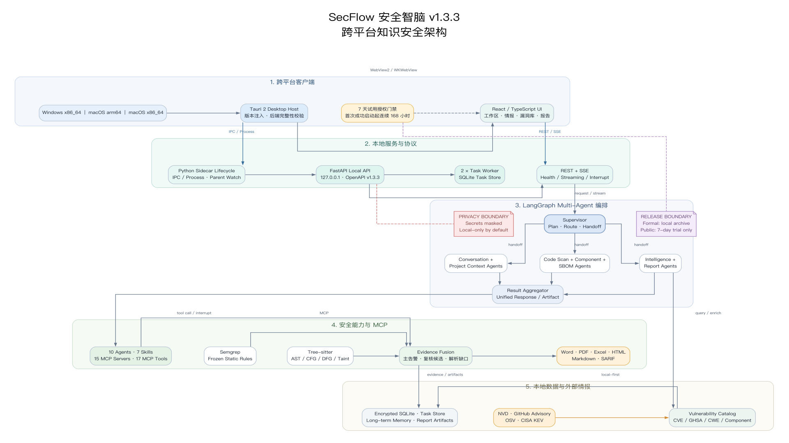
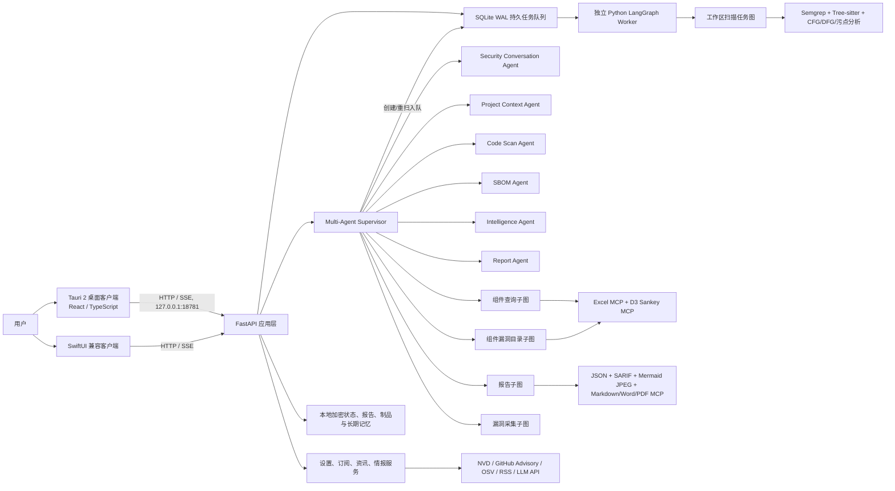

# SecFlow 项目架构文档

## 1. 文档信息

| 项目 | 内容 |
| --- | --- |
| 产品 | SecFlow Knowledge Security Assistant / 安全智脑 |
| 版本 | 1.3.3（跨平台生命周期与七天试用发布基线） |
| 客户端 | Tauri 2 + React/TypeScript；保留 SwiftUI 兼容实现 |
| 后端 | Python 3、FastAPI、LangGraph |
| 桌面通信 | 正式版 `127.0.0.1:18781`；试用版 `127.0.0.1:18783` |
| 应用标识 | 正式版 `ai.secflow.security-agent`；试用版 `ai.secflow.security-agent.trial7days` |
| 文档基线 | 2026-08-18 v1.3.3 发布源码快照 |

## 2. 总体架构

v1.3.3 的企业报告链路采用单一事实源：Scanner、Analysis、RAG、Report Planner、Chart Planner、AI Writer 与 QA Agent 只生成或校验一份 `Unified Report JSON`；Template、Chart、Report、Word、Excel、PDF、HTML、Markdown 和 SARIF MCP 均消费这份冻结数据。平台适配器只处理字体、保存对话框、打开方式和预览，不改变报告事实。



> 已将本章的抽象模块、协议和数据流作为提示词提交给 MedPeer 科研绘图；试用账号因平台研值前置条件未返回图片，且免费研值任务要求补充真实个人资料后审核。当前 PNG 由同一份抽象描述通过本地 [Graphviz 源文件](assets/secflow-architecture-v1.3.3.dot) 生成，不冒充 MedPeer 产物。提交给第三方的内容不包含源码、密钥、用户目录或运行数据。

```text
Unified Report JSON
  ├─ report / summary / statistics
  ├─ charts / findings / appendix
  └─ provenance / input_hash / locale
        ├─ Template MCP -> 品牌、字体、页眉页脚
        ├─ Chart MCP    -> SVG/PNG/JPEG/ECharts/Mermaid
        └─ Export MCP   -> DOCX/XLSX/PDF/HTML/MD/SARIF
```

情报采集阶段先完成批量翻译和确定性风险等级本地化，再将译文与原文一起写入 catalog。报告生成阶段禁止重新遍历大结果调用翻译服务；译文缺失时保留原文并标记待补译，从而避免重复调用和报告卡顿。



客户端负责桌面窗口、导航、交互状态和文件选择；嵌入式后端承担业务规则、智能体编排、扫描、情报采集、报告生成与持久化。第三阶段 Tauri 构建将 Python sidecar、Semgrep 和离线规则作为应用资源，由客户端随应用生命周期启动和停止。

## 3. 代码目录与职责

| 路径 | 职责 |
| --- | --- |
| `app/api/routes/application.py` | FastAPI 应用、中间件、API 路由和静态 Web 控制台 |
| `app/langgraph/assistant_graph.py` | 智能问答主图、意图分类、知识图谱、静态分析、LLM 与记忆 |
| `app/langgraph/multi_agent_graph.py` | Supervisor、专业 Agent 路由、显式 handoff、结果聚合和在线规则隔离策略 |
| `app/agent/contracts.py` | Agent 能力清单、统一执行结果与 handoff 审计契约 |
| `app/agent/specialist_agents.py` | Project Context、Code Scan、SBOM 与许可专属能力适配器 |
| `app/agent/project_context.py` | 用户隔离的项目/SBOM/任务工作区恢复、路径复验与歧义阻断 |
| `app/agent/assistant_intent.py` | LLM 语义能力规划、日期归一化、筛选白名单与确定性兜底 |
| `app/langgraph/collector_graph.py` | 漏洞采集器 LangGraph 子图 |
| `app/langgraph/component_query_graph.py` | 组件坐标解析、漏洞查询、Excel 与 Sankey 制品生成 |
| `app/langgraph/component_catalog_graph.py` | 按时间查询组件漏洞目录、固定结果、两阶段 Excel interrupt |
| `app/langgraph/sbom_graph.py` | 项目依赖与许可识别、SBOM JSON、组件漏洞匹配与三阶段 Excel interrupt |
| `app/langgraph/report_graph.py` | 报告请求解析、两阶段 interrupt、JSON/SARIF/Mermaid JPEG/格式转换 |
| `app/agent/task_agent.py` | 工作区任务图、按语言扫描子图、SSE 事件和报告确认流程 |
| `app/agent/task_worker.py` | 持久队列 Worker、任务租约心跳、父进程监管、崩溃恢复和打包子进程入口 |
| `app/agent/project_adaptive_scan.py` | 上传项目画像、受限 Overlay 生成、验证和差分策略 |
| `app/agent/task_store.py` | SQLite WAL 任务表、追加式事件表、字段加密、旧 JSON 自动迁移与归档状态持久化 |
| `app/mcp/code_scan.py` | 独立扫描 SSE MCP、只读工作区校验，以及按令牌白名单隔离的逐语言/许可工具 Schema |
| `app/mcp/code_scan_client.py` | 动态 loopback 端口、Agent 专属工具 allowlist、能力令牌、子进程生命周期、取消与结果审计 |
| `app/mcp/component_query.py` | Excel 与 D3 Sankey MCP 工具和组件查询制品管理 |
| `app/mcp/license_scan.py` | SPDX、清单、许可证文件识别及 OSI License API 标准化 |
| `app/mcp/sbom.py` | SBOM Excel MCP、五表工作簿和 SBOM 制品管理 |
| `app/mcp/report_charts.py` | 报告图表 MCP 与报告 MCP 清单聚合 |
| `app/mcp/report_sarif.py` | 将扫描事实转换为 SARIF 2.1.0，并在 `codeFlows/threadFlows/locations` 保留完整污点路径 |
| `app/mcp/report_mermaid.py` | 从 SARIF 完整污点路径生成 Mermaid 源码及哈希校验 JPEG 图形 |
| `app/mcp/report_markdown.py` | 生成并校验 Markdown 报告 |
| `app/mcp/report_word.py` | 生成带真实标题、列表和表格结构的 DOCX 报告 |
| `app/mcp/report_pdf.py` | 从同一报告 JSON 生成 PDF 报告 |
| `app/semgrep_tool.py`、`app/semgrep_runner.py` | Semgrep 规则扫描与运行时封装 |
| `app/*_analyzer.py` | Tree-sitter、AST、CFG、DFG、污点及语言专项分析 |
| `app/intelligence.py`、`app/information.py` | 漏洞情报、订阅源、缓存、刷新与图片回退 |
| `app/storage.py`、`app/secure_storage.py` | 本地状态、密钥派生与加密存储 |
| `app/reports.py` | 扫描结果、报告元数据与文件制品 |
| `macos/SecFlowMac/` | Swift Package、SwiftUI 客户端、资源和客户端测试 |
| `desktop/SecFlowTauri/` | 第三阶段 Tauri 2、React/TypeScript 客户端和 Rust sidecar 生命周期 |
| `config/semgrep/` | 按语言维护的安全规则 |
| `config/evaluation/` | 冻结评测项目清单、真值和裁决配置 |
| `scripts/` | 构建、评测、真值校验和回归门禁脚本 |
| `tests/` | Python 单元、接口、扫描、报告和评测门禁测试 |
| `docs/` | 评测证据、发布说明和项目文档 |

## 4. 运行时组件

### 4.1 桌面客户端

#### 4.1.1 Tauri 2 主客户端

- `desktop/SecFlowTauri` 是第三阶段主客户端，React 只处理视图和本地交互状态，扫描、报告和 Agent 决策仍由 Python LangGraph 完成。
- Rust 宿主通过 Tauri `externalBin` 启动 FastAPI sidecar，显式注入应用数据目录、Semgrep 可执行文件和离线规则目录，并在应用退出时终止子进程。
- Rust 宿主把 `CARGO_PKG_VERSION` 注入 `SECFLOW_APP_VERSION`，保证安装包、关于页和 OpenAPI 使用同一个版本号。
- Windows 不创建 macOS 专属透明资讯窗口和状态栏入口；父进程存活探测使用 Win32 `OpenProcess` / `WaitForSingleObject`，宿主被强制终止后 sidecar 会退出。
- 问答正文按 50 ms 合并 SSE 分片；任务先读快照，再按 `sequence` 合并事件，终态事件后重新读取完整结果。
- 侧栏使用固定 72 px 布局轨道和覆盖式悬停展开，展开时不修改主工作区网格宽度，避免复杂聊天页面发生连续布局重排。
- UI 只采用真实 21st.dev `人工智能前端` 收藏清单中的 Advanced Stats、Card、Chatgpt Prompt Input 和 AI Planning 四种信息结构；映射、ZCode 取舍、E2E 和打包说明见 [第三阶段基线](TAURI_PHASE3.md)。

#### 4.1.2 SwiftUI 兼容客户端

- `SecFlowMacApp` 管理主窗口、设置窗口、菜单命令和后端生命周期。
- `RootView` 在登录后根据资料和模型完成态路由到 6 步 `PostLoginSetupView` 或工作区；向导可恢复到第一个缺失阶段。
- `PostLoginSetupView` 复用设置资料 API 和模型配置 API，资料与角色保存成功后才开放模型步骤，模型测试成功后才允许启用并进入工作区。
- `WorkspaceShellView` 提供鼠标悬停自动展开、移出自动收回的覆盖式侧边栏，主操作仅保留“新建任务”。
- 智能问答支持会话、文件上传、SSE 正文增量输出、Skeleton、Markdown/Mermaid、漏洞卡片、来源面板、消息操作、提示词差异卡片和 LangGraph 节点状态。
- Agent 时间线只消费后端真实 trace；Tool Call 和 Sources 默认折叠，Thinking 只投影高层节点任务，不传输或展示私有推理。
- UI 交互层参考 21st.dev 的 AI Tool Call、Chain of Thought、Sources、Prompt Box 和 Actions 模式，以原生 SwiftUI 重新实现，不引入 React 运行时。
- 普通问答历史作为“智能问答”项目显示在“项目”区；活动对话和扫描项目并列管理，归档对话进入统一归档区，右键菜单提供归档、恢复和二次确认删除。
- 信息咨询使用固定在屏幕右上角的独立 `NSPanel`；漏洞情报总览使用独立 `NSWindow`，仅消费漏洞情报目录统计，不展示代码扫描结果，二者均不占用主导航项。
- 设置包含用户资料、模型配置、订阅管理、日志管理、通用设置和关于。
- 字体入口由统一设计系统管理：中文优先 PingFang SC，英文优先 SF Pro Text，Emoji 由 Apple Color Emoji 回退。
- 高频状态不再全部由 `AppModel` 发布：`AssistantStore` 负责正文、trace 和会话，`AgentTaskStore` 负责任务快照和事件；`AppModel` 仅保留兼容访问器。聊天工作区和项目历史按需订阅这两个 Store，进度更新不会让设置、情报和总览页面重算。
- 问答 SSE 的正文分片在客户端按 50 ms 窗口合并后再提交主线程，trace 按稳定 ID 增量覆盖；`result` 或 `error` 到达前强制清空缓冲。

### 4.2 FastAPI 应用

- 规范应用入口为 `app.api.routes.application:app`；桌面入口为 `app.macos_backend`。
- `app.main`、`app.graph` 等根级旧模块仅作为同一模块对象的兼容别名，不保存实现，也不进入新代码依赖链。
- 桌面正式运行仅监听回环地址 `127.0.0.1:18781`。
- `/api/agent/tasks/{task_id}/events` 使用 Server-Sent Events 推送节点、计划、进度、中断和完成事件。
- 任务 SSE 以 SQLite `task_events.sequence` 作为事件 ID，接受查询参数 `after` 和标准 `Last-Event-ID`。客户端先读取一次任务快照，再增量合并事件；断线按 2/5/10 秒退避重连，连续失败后才使用任务 GET 兜底。终态事件后必须读取包含结果的完整快照，不能仅凭事件开放报告入口。
- `/api/assistant/questions/stream` 在图执行期间推送真实 `trace`；OpenAI Responses、OpenAI-compatible Chat Completions 和 Anthropic 直接转发供应商文本 delta，确定性回答或不支持流式的上游才使用最终正文兼容分片；最后发送规范 `result`，异常通过 `error` 结束流。推理/思考字段不进入 `content`。
- FastAPI 控制面只校验、入队、取消并读取状态，不执行项目 LangGraph。`task_jobs` 通过原子租约把任务交给独立 Python Worker；Worker 每三分之一租约周期续租，进程退出后由监管器重启，过期任务最多恢复三次。
- 统一业务响应为 `status`、`message`、`data`；文件下载和 SSE 使用各自媒体类型。
- 试用期中间件会在试用失效时阻断核心 `/api`，但保留试用状态与订阅接口。

### 4.3 Multi-Agent Supervisor 与智能问答主图

智能问答同时提供完整客户端入口 `app.main:app` 和独立入口 `app.assistant_app:app`。独立入口通过 `app/api/routes/assistant.py` 只挂载问答、SSE、LangGraph、Interrupt、制品和会话 API；`app/agent/assistant_service.py` 负责共享问答调用与 Interrupt 协议，避免复制提示词或子图。独立入口不包含工作区扫描任务、订阅、资讯或设置管理路由。

顶层运行时采用 `Supervisor + Specialists`：Supervisor 只负责语义规划、能力选择和 handoff，不读取项目文件或生成制品；Project Context Agent 只恢复用户隔离的源码工作区；Code Scan、Component、SBOM、Vulnerability Intelligence、Report 和 Security Conversation Agent 各自拥有固定能力与工具白名单；Result Aggregator Agent 合并公开结果和交接审计。统一响应增加 `orchestration.schema_version=secflow.multi-agent/v1`、实际参与 Agent 和 handoff 列表。独立问答入口使用相同 Supervisor，但不注入任务服务，因此不能创建或重扫本机项目任务。

```text
supervisor_agent
  -> project_context_agent -> code_scan_agent | sbom_agent
  -> component_agent | intelligence_agent | report_agent | conversation_agent
  -> result_aggregator_agent
```

任一在线 Agent 的 `can_mutate_global_analysis` 均为 `false`。Code Scan Agent 只能生成当前任务的项目级 Overlay；500 项目评测保持原冻结脚本、规则、引擎参数和进程内路径，不能通过在线 handoff 触发或修改。

专业 Agent 内部复用原有能力子图，主图节点顺序和条件分支如下：

1. `classify_query`：结合整段请求、会话、附件、授权工作区和期望产物进行语义规划，识别普通问答、组件目录/版本查询、项目 SBOM、报告操作或代码安全问题，不按单一关键词锁死意图。
2. 对“实际执行项目扫描/SBOM”的意图，`resolve_project_workspace` 在进入扫描任务前按显式工作区、当前会话/任务、精确制品关联和无歧义历史项目恢复源码范围。恢复结果必须属于当前 `user_id`，并重新验证存在性、可读性、符号链接和文件系统根目录限制；SBOM 文件名本身永远不会被转换或猜测为本机路径。
3. `load_memory_context`：读取用户/会话长期上下文。
4. `component_query_subgraph`：组件坐标查询分支。
5. `project_sbom_subgraph`：项目组件资产、可选漏洞匹配和 Excel 分支。
6. `report_capability_subgraph`：报告生成与下载分支。
7. `query_intelligence`：检索漏洞情报。
8. `run_static_analysis`：对附件执行静态与语义分析。
9. `enrich_knowledge_graph`：补充实体和关系证据。
10. `call_llm`：调用已配置模型完成受证据约束的推理。
11. `translate_vulnerability_card`：按界面语言转换漏洞卡片。
12. `compose_answer`：组合答案、工具调用和制品。
13. `persist_memory`：保存可复用会话记忆。

安全回答提示词按事实选择“漏洞摘要、影响范围、漏洞详情、利用条件、风险分析、修复建议、参考来源”等章节，不强制输出空章节。公开来源名称和 URL 可展示；凭证、内部集合、私有端点、完整请求载荷、私有推理和攻击性 PoC 会被禁止或脱敏。

### 4.4 工作区扫描任务图

顶层任务流：

```text
inspect_workspace -> detect_languages -> plan_task -> project_scan_subgraph
                  -> verify_results -> compose_result
```

项目扫描子图：

```text
scan_dependencies -> SBOM Agent / identify_project_licenses -> profile_project -> dispatch_language
  -> scan_<language> -> Code Scan MCP / scan_language（SSE，逐语言循环）
  -> fuse_analysis_evidence
  -> synthesize_project_overlay
  -> rescan_project_overlay（条件循环，最多三轮）
```

扫描顺序优先读取依赖清单，再显式交接 SBOM Agent。SBOM Agent 调用独立 `SecFlow License MCP / identify_project_licenses`，只读取 SPDX、结构化清单和许可证文件，并通过固定 OSI License API 标准化结果；`SecFlow Code Scan MCP` 只暴露 `scan_language`。OSI 不可用时许可覆盖标记为 `partial`，本地证据继续进入结果和报告。普通上传的语言节点通过按需启动的 MCP 子进程执行静态规则和 AST/CFG/DFG/污点语义引擎；服务只绑定动态 loopback 端口并记录进程、耗时及输入/输出 SHA-256。普通上传使用 `complete_workspace_scan`，项目 Overlay 仍严格限制在当前任务，冻结评测路径保持不变。独立 SBOM 流程只读取依赖清单和锁文件；没有清单时返回空组件和明确警告，不回退读取源码导入。

支持的分析语言由运行时语言注册表决定，当前规则目录覆盖 Java、Go、Python、C、C++、C#、Rust 和 Solidity；无法解析或未支持的文件会在任务结果中显式计数。

### 4.5 500 项目冻结评测隔离

`config/evaluation/github-multilang-high-star-random-500-2026-07-23.json` 是多语言高星项目评测清单。评测运行必须满足：

- 固定项目、提交、抽样方法和真值版本，可复现运行。
- 使用冻结的共享规则和引擎版本，不启用上传项目自适应 Overlay，并保持原进程内扫描路径，不受 MCP SSE 传输变化影响。
- 保留原 300 文件、500 KB 单文件、6 MB 总读取量、Semgrep 180/15 秒和 Java 18 秒保护配置，避免普通上传完整扫描改变历史基线。
- 项目 Overlay、模型候选和普通用户任务结果不得写回评测配置或计入资格指标。
- 指标和失败归因由评测脚本生成，门禁目标为观察到的漏报数 0、precision/准确率至少 95%，并持续降低误报。
- 规则、解析器或 CFG/DFG/污点引擎升级后，必须重新运行真值校验与回归门禁，不能用单项目结果替代 500 项目评测。

### 4.6 组件查询子图

```text
parse_component_coordinates
  -> query_component_vulnerabilities
  -> excel_mcp
  -> d3_sankey_mcp
  -> compose_component_result
```

组件查询从问答入口进入，解析名称、版本和生态后查询本地及实时漏洞源，随后生成可下载的 Excel 数据和 D3 Sankey 关系数据。制品通过 `/api/assistant/artifacts/{artifact_id}` 下载。

时间范围组件漏洞目录由 LLM 语义规划器选择能力并提取时间、生态、风险和组件筛选，后端对计划执行白名单与日期范围校验。子图先查询并展示固定结果，再通过 `component_excel_generation_confirmation` 确认生成 Excel；Excel MCP 只消费该固定结果。生成后通过 `component_excel_download_confirmation` 确认保存，macOS 使用 `NSSavePanel` 选择目录。两个中断统一通过 `/api/assistant/interrupts/resume` 恢复。

项目 SBOM 使用独立子图：先从授权工作区抽取依赖，再由 SBOM Agent 的许可专属能力识别项目许可；依赖与许可证据共同生成 CycloneDX 兼容 JSON。三个 interrupt 分别确认漏洞匹配、Excel 生成和下载。每次中断后将线程、项目/会话、组件数、匹配覆盖、漏洞记录、许可事实和待确认节点写入用户隔离的加密操作快照。普通追问“存在哪些漏洞”进入 `sbom_result_follow_up`，只读 checkpoint 或快照且不消费原 interrupt；新会话可恢复同一用户最近结果，其他用户不可读取。

### 4.7 报告子图与人机协同

```text
parse_report_request -> load_report_catalog -> interrupt_generate_report
  -> build_scan_result_json -> report_sarif_mcp -> report_chart_mcp -> prepare_report_draft
  -> report_mermaid_mcp -> report_markdown_mcp -> report_word_mcp
  -> report_pdf_mcp -> persist_report -> interrupt_download_report
  -> prepare_report_download
  -> compose_report_result
```

- 第一次 interrupt 在生成前确认，取消后不会生成报告。
- 扫描和依赖结果先规范化为带 SHA-256 的 JSON，再由 SARIF MCP 生成 SARIF 2.1.0。每条污点路径使用 `codeFlows/threadFlows/locations` 按原顺序保留 source、传播、sanitizer、sink 的角色、文件、行号、标签和代码片段，不使用节点数量截断。
- Mermaid MCP 逐条消费 SARIF thread flow，生成可审计 Mermaid 源码并转为 JPEG；长路径通过增长画布完整呈现。HTML、DOCX、PDF 直接消费同一 canonical JSON，并按 SHA-256 嵌入完全相同的 JPEG 字节，不以 Markdown 作为 Word/PDF 的中间数据协议，也不显示原始关系 state、JSON 或 Mermaid 代码块。
- canonical JSON、SARIF JSON、Mermaid 源码哈希和 JPEG 哈希作为审计证据保留；`thread_flow_location_count`、`taint_node_count` 和每张 JPEG 的 `node_count` 必须一致，SARIF 或图形生成失败会中止报告生成。
- MD、DOCX 与 PDF 由不同 MCP 生成；每个 MCP 独立记录输入/输出哈希、MIME、大小、时间和错误。制品签名或哈希失败时不得登记该格式。
- 第二次 interrupt 在下载前确认，并由用户选择单一格式、全部格式或批量报告。
- 扫描报告必须满足 `report_ready`：结果已经固化、计划步骤全部终态并存在 `task.completed` 事件。前端和后端都执行该门禁。
- 历史 `node.started/node.progress` 在对应节点完成后折叠，不再以运行中动画误导用户；报告事件也不会覆盖扫描任务的 `current_node`。
- interrupt 使用 LangGraph `thread_id` 保存状态；智能问答统一通过 `/api/assistant/interrupts/resume` 恢复，兼容报告接口仍保留 `/api/reports/actions/resume`。

## 4.8 命名与兼容约定

- Python 包、模块、函数和变量使用 `snake_case`，类和类型使用 `UpperCamelCase`。
- Swift 类型使用 `UpperCamelCase`，属性和方法使用 `lowerCamelCase`。
- HTTP 路径使用小写资源名；多词段采用 kebab-case，例如 `report-download-decision`。
- 主资源按领域分组：`/api/assistant`、`/api/agent`、`/api/langgraph`、`/api/mcp`、`/api/reports` 和 `/api/system`。
- 旧 `/api/ask`、`/api/tasks`、`/api/graph`、`/api/runtime` 与 `/api/report-actions` 路径继续响应现有客户端，但从 OpenAPI 隐藏；新代码不得再引用这些旧路径。

## 5. 数据与状态

默认运行数据位于项目 `data/` 或打包应用配置的用户数据目录，主要包含：

- 采集器、设置、订阅、资讯缓存和 LLM 配置。
- 任务快照、最近最多 500 条任务事件和归档状态。
- 扫描 JSON、报告元数据、HTML/PDF/DOCX/Markdown 与助手制品。
- 普通问答交换记录及其项目、归档元数据，以及用户提交项目时写入的项目名称、任务编号、目标和会话关联；配置 PostgreSQL 时分别写入会话交换表、会话元数据表和长期记忆摘要，否则写入同一份本地加密 JSON。源码绝对路径、任务和制品映射只保存在本机加密 `projectLinks`，不会写入可下载 SBOM/报告或跨设备会话内容。所有记录按 `user_id` 隔离。
- 删除单个普通问答会话时会重建该用户的长期记忆摘要，避免已删除内容继续被召回；归档只改变列表状态，不删除问答内容。
- 敏感字段通过 `app/secure_storage.py` 的加密封装保存，公开响应会移除密钥。

工作区任务默认存储为 `data/tasks/tasks.sqlite3`：

- SQLite 启用 WAL、外键和 `busy_timeout`，`tasks`、`task_events` 与 `task_jobs` 分表。
- 事件追加写入并按 `sequence` 分页读取，单任务保留最近 500 条；删除任务时事件由外键级联删除。
- `task_jobs` 保存排队状态、可执行时间、租约所有者、租约到期、心跳、尝试次数和失败摘要；Worker 通过 `BEGIN IMMEDIATE` 原子领取，其他 Worker 在租约有效期内不能重复执行。
- API 或 Worker 异常退出不会把运行中任务标记为完成；有效租约继续由原 Worker 持有，缺失或过期租约重新排队并产生 `task.requeued/task.recovered` 审计事件。连续恢复超过三次后失败关闭，避免无限重试。
- 任务 payload 与事件 payload 分别沿用 AES 加密；用户索引保存 SHA-256，不在索引列写入明文用户标识。
- 旧加密 `tasks.json` 在首次启动时自动导入 SQLite，原文件保留用于审计和回退。
- 大型 SARIF、图像和报告继续保存为文件制品，数据库只保存任务事实与引用。

桌面拓扑保持一个 FastAPI 控制进程，由 `TaskWorkerProcessSupervisor` 按需启动最多四个独立 Worker。源码运行使用 `python -m app.agent.task_worker`，PyInstaller 构建复用同一后端可执行文件的 `--task-worker` 入口。单元测试只有在显式注入测试 Graph/Scanner 时使用内联执行器，生产默认不回退到 API 线程执行扫描。

源码快照和发布交付不包含 `data/`、`output/`、`tmp/` 等运行数据目录。

## 6. 外部依赖与集成

- LLM：OpenAI、Anthropic Claude、DeepSeek 及兼容自定义端点。
- 漏洞：NVD、GitHub Advisory、OSV 和本地知识库。
- 许可：Open Source Initiative 官方 License API；不可用时保留本地 SPDX 与许可证文件识别结果。
- 静态分析：Semgrep 1.170.0。
- 语法分析：Tree-sitter 及 Java、Python、Go、C/C++、C#、Rust、Solidity 语法包。
- 报告：ReportLab、XlsxWriter、HTML 渲染和本地 MCP 工具描述。
- 存储：本地加密文件，可选 PostgreSQL 长期记忆。

## 7. 安全边界

- 当前 API 没有完整的服务端登录认证；`user_id` 多数由客户端提交，任务接口主要执行记录归属比较。回环绑定降低了桌面版暴露面，但不是完整鉴权。
- 支付回调使用 `X-SecFlow-Signature` HMAC 校验，并应同时保证事件幂等。
- 面向远程或多用户部署时，必须增加 TLS、反向代理、服务端身份认证、授权和审计。
- 扫描器按只读方式读取工作区；不得执行上传项目中的构建脚本、包管理器钩子或任意命令。
- 问答附件与冻结评测有类型、数量、名称、大小和内容长度限制；普通工作区任务读取全部受支持生产源码与清单，但仍执行路径、文件类型、符号链接、二进制内容和构建目录过滤；输出前执行隐私清洗。
- 项目级 Overlay 必须保持任务隔离、有界迭代和失败关闭，不能成为修改冻结评测基线的旁路。

## 8. 构建与运行

开发后端：

```bash
python3 -m venv .venv
.venv/bin/pip install -r requirements.txt
.venv/bin/uvicorn app.api.routes.application:app --host 127.0.0.1 --port 8000
```

macOS 客户端开发与测试：

```bash
cd macos/SecFlowMac
swift run SecFlowMac
swift test
```

正式 macOS 打包：

```bash
./scripts/build_macos_app.sh
```

构建脚本会创建原生 Swift 可执行文件、嵌入 Python 后端和依赖、复制许可文件、签名 App，并生成 `dist/SecFlow.zip`。
