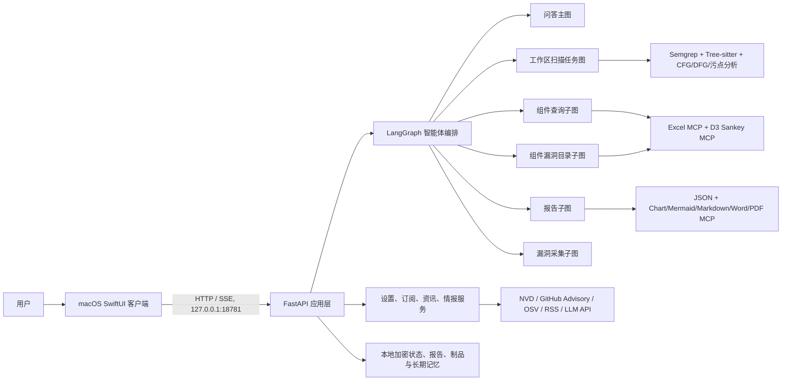

# SecFlow 项目架构文档

## 1. 文档信息

| 项目 | 内容 |
| --- | --- |
| 产品 | SecFlow Knowledge Security Assistant / 安全智脑 |
| 版本 | 1.2.0（内测版） |
| 客户端 | 原生 macOS SwiftUI，最低 macOS 14.0 |
| 后端 | Python 3、FastAPI、LangGraph |
| 桌面通信 | `http://127.0.0.1:18781` |
| Bundle ID | `ai.secflow.knowledge-assistant` |
| 文档基线 | Git `e546d30425616eeb58b151e793b1d01bd6523da0` 加当前工作树快照 |

## 2. 总体架构



客户端负责原生窗口、导航、交互状态和文件选择；嵌入式后端承担业务规则、智能体编排、扫描、情报采集、报告生成与持久化。正式 macOS 构建将 Python 后端和运行依赖打包到 `SecFlow.app`，由客户端随应用生命周期启动和停止。

## 3. 代码目录与职责

| 路径 | 职责 |
| --- | --- |
| `app/api/routes/application.py` | FastAPI 应用、中间件、API 路由和静态 Web 控制台 |
| `app/langgraph/assistant_graph.py` | 智能问答主图、意图分类、知识图谱、静态分析、LLM 与记忆 |
| `app/agent/assistant_intent.py` | LLM 语义能力规划、日期归一化、筛选白名单与确定性兜底 |
| `app/langgraph/collector_graph.py` | 漏洞采集器 LangGraph 子图 |
| `app/langgraph/component_query_graph.py` | 组件坐标解析、漏洞查询、Excel 与 Sankey 制品生成 |
| `app/langgraph/component_catalog_graph.py` | 按时间查询组件漏洞目录、固定结果、两阶段 Excel interrupt |
| `app/langgraph/sbom_graph.py` | 项目 SBOM JSON、组件漏洞匹配与三阶段 Excel interrupt |
| `app/langgraph/report_graph.py` | 报告请求解析、两阶段 interrupt、JSON/图表/格式转换 |
| `app/agent/task_agent.py` | 工作区任务图、按语言扫描子图、SSE 事件和报告确认流程 |
| `app/agent/project_adaptive_scan.py` | 上传项目画像、受限 Overlay 生成、验证和差分策略 |
| `app/agent/task_store.py` | 加密任务、计划、事件和归档状态持久化 |
| `app/mcp/component_query.py` | Excel 与 D3 Sankey MCP 工具和组件查询制品管理 |
| `app/mcp/sbom.py` | SBOM Excel MCP、四表工作簿和 SBOM 制品管理 |
| `app/mcp/report_charts.py` | 报告图表 MCP 与报告 MCP 清单聚合 |
| `app/mcp/report_mermaid.py` | 从扫描 JSON 和图表事实生成 Mermaid 关系图 |
| `app/mcp/report_markdown.py` | 生成并校验 Markdown 报告 |
| `app/mcp/report_word.py` | 生成带真实标题、列表和表格结构的 DOCX 报告 |
| `app/mcp/report_pdf.py` | 从同一报告 JSON 生成 PDF 报告 |
| `app/semgrep_tool.py`、`app/semgrep_runner.py` | Semgrep 规则扫描与运行时封装 |
| `app/*_analyzer.py` | Tree-sitter、AST、CFG、DFG、污点及语言专项分析 |
| `app/intelligence.py`、`app/information.py` | 漏洞情报、订阅源、缓存、刷新与图片回退 |
| `app/storage.py`、`app/secure_storage.py` | 本地状态、密钥派生与加密存储 |
| `app/reports.py` | 扫描结果、报告元数据与文件制品 |
| `macos/SecFlowMac/` | Swift Package、SwiftUI 客户端、资源和客户端测试 |
| `config/semgrep/` | 按语言维护的安全规则 |
| `config/evaluation/` | 冻结评测项目清单、真值和裁决配置 |
| `scripts/` | 构建、评测、真值校验和回归门禁脚本 |
| `tests/` | Python 单元、接口、扫描、报告和评测门禁测试 |
| `docs/` | 评测证据、发布说明和项目文档 |

## 4. 运行时组件

### 4.1 macOS 客户端

- `SecFlowMacApp` 管理主窗口、设置窗口、菜单命令和后端生命周期。
- `RootView` 在登录后根据资料和模型完成态路由到 6 步 `PostLoginSetupView` 或工作区；向导可恢复到第一个缺失阶段。
- `PostLoginSetupView` 复用设置资料 API 和模型配置 API，资料与角色保存成功后才开放模型步骤，模型测试成功后才允许启用并进入工作区。
- `WorkspaceShellView` 提供鼠标悬停自动展开、移出自动收回的覆盖式侧边栏，主操作仅保留“新建任务”。
- 智能问答支持会话、文件上传、SSE 正文增量输出、Skeleton、Markdown/Mermaid、漏洞卡片、来源面板、消息操作、提示词差异卡片和 LangGraph 节点状态。
- Agent 时间线只消费后端真实 trace；Tool Call 和 Sources 默认折叠，Thinking 只投影高层节点任务，不传输或展示私有推理。
- UI 交互层参考 21st.dev 的 AI Tool Call、Chain of Thought、Sources、Prompt Box 和 Actions 模式，以原生 SwiftUI 重新实现，不引入 React 运行时。
- 普通问答历史作为“智能问答”项目显示在“项目”区；活动对话和扫描项目并列管理，归档对话进入统一归档区，右键菜单提供归档、恢复和二次确认删除。
- 信息咨询使用固定在屏幕右上角的独立 `NSPanel`；漏洞情报总览使用独立 `NSWindow`，仅消费漏洞情报目录统计，不展示代码扫描结果，二者均不占用主导航项。
- 设置包含用户资料、模型配置、订阅管理、日志管理、通用设置和关于。
- 字体入口由统一设计系统管理：中文优先 PingFang SC，英文优先 SF Pro Text，Emoji 由 Apple Color Emoji 回退。

### 4.2 FastAPI 应用

- 规范应用入口为 `app.api.routes.application:app`；桌面入口为 `app.macos_backend`。
- `app.main`、`app.graph` 等根级旧模块仅作为同一模块对象的兼容别名，不保存实现，也不进入新代码依赖链。
- 桌面正式运行仅监听回环地址 `127.0.0.1:18781`。
- `/api/agent/tasks/{task_id}/events` 使用 Server-Sent Events 推送节点、计划、进度、中断和完成事件。
- `/api/assistant/questions/stream` 先推送真实 `trace`，再以无损 `content` 分片增量推送 Markdown 正文，最后发送规范 `result`；异常通过 `error` 结束流。
- 统一业务响应为 `status`、`message`、`data`；文件下载和 SSE 使用各自媒体类型。
- 试用期中间件会在试用失效时阻断核心 `/api`，但保留试用状态与订阅接口。

### 4.3 智能问答主图

智能问答同时提供完整客户端入口 `app.main:app` 和独立入口 `app.assistant_app:app`。独立入口通过 `app/api/routes/assistant.py` 只挂载问答、SSE、LangGraph、Interrupt、制品和会话 API；`app/agent/assistant_service.py` 负责共享问答调用与 Interrupt 协议，避免复制提示词或子图。独立入口不包含工作区扫描任务、订阅、资讯或设置管理路由。

主图节点顺序和条件分支如下：

1. `classify_query`：结合整段请求、会话、附件、授权工作区和期望产物进行语义规划，识别普通问答、组件目录/版本查询、项目 SBOM、报告操作或代码安全问题，不按单一关键词锁死意图。
2. `load_memory_context`：读取用户/会话长期上下文。
3. `component_query_subgraph`：组件坐标查询分支。
4. `project_sbom_subgraph`：项目组件资产、可选漏洞匹配和 Excel 分支。
5. `report_capability_subgraph`：报告生成与下载分支。
6. `query_intelligence`：检索漏洞情报。
7. `run_static_analysis`：对附件执行静态与语义分析。
8. `enrich_knowledge_graph`：补充实体和关系证据。
9. `call_llm`：调用已配置模型完成受证据约束的推理。
10. `translate_vulnerability_card`：按界面语言转换漏洞卡片。
11. `compose_answer`：组合答案、工具调用和制品。
12. `persist_memory`：保存可复用会话记忆。

安全回答提示词按事实选择“漏洞摘要、影响范围、漏洞详情、利用条件、风险分析、修复建议、参考来源”等章节，不强制输出空章节。公开来源名称和 URL 可展示；凭证、内部集合、私有端点、完整请求载荷、私有推理和攻击性 PoC 会被禁止或脱敏。

### 4.4 工作区扫描任务图

顶层任务流：

```text
inspect_workspace -> detect_languages -> plan_task -> project_scan_subgraph
                  -> verify_results -> compose_result
```

项目扫描子图：

```text
scan_dependencies -> profile_project -> dispatch_language
  -> scan_<language>（逐语言循环）
  -> fuse_analysis_evidence
  -> synthesize_project_overlay
  -> rescan_project_overlay（条件循环，最多三轮）
```

扫描顺序优先读取依赖清单，再运行语言静态规则和 AST/CFG/DFG/污点语义引擎。普通上传使用 `complete_workspace_scan`：读取全部受支持生产源码与清单，Semgrep 使用 0 表示取消进程、单规则和目标大小保护，Java 取消 18 秒与方法数量上限并迭代到跨方法摘要语义收敛；用户取消仍可终止外部扫描进程。证据融合后，仅在普通上传任务启用项目自适应：模型只能生成具有作用域、置信度和指纹的任务级 Overlay，经约束校验后进行沙箱重扫和差分比较。Overlay 不修改全局 Semgrep 规则，不写入语言引擎源码，并在失败时回退到基线结果。

支持的分析语言由运行时语言注册表决定，当前规则目录覆盖 Java、Go、Python、C、C++、C#、Rust 和 Solidity；无法解析或未支持的文件会在任务结果中显式计数。

### 4.5 500 项目冻结评测隔离

`config/evaluation/github-multilang-high-star-random-500-2026-07-23.json` 是多语言高星项目评测清单。评测运行必须满足：

- 固定项目、提交、抽样方法和真值版本，可复现运行。
- 使用冻结的共享规则和引擎版本，不启用上传项目自适应 Overlay。
- 保留原 300 文件、500 KB 单文件、6 MB 总读取量、Semgrep 180/15 秒和 Java 18 秒保护配置，避免普通上传完整扫描改变历史基线。
- 项目 Overlay、模型候选和普通用户任务结果不得写回评测配置或计入资格指标。
- 指标和失败归因由评测脚本生成，门禁目标为观察到的漏报数 0、precision/准确率至少 95%，并持续降低误报。
- 规则、解析器或 CFG/DFG/污点引擎升级后，必须重新运行真值校验与回归门禁，不能用单项目结果替代 500 项目评测。

### 4.6 组件查询子图

```text
parse_component_coordinates
  -> query_component_vulnerabilities
  -> excel_mcp
  -> d3_sankey_mcp
  -> compose_component_result
```

组件查询从问答入口进入，解析名称、版本和生态后查询本地及实时漏洞源，随后生成可下载的 Excel 数据和 D3 Sankey 关系数据。制品通过 `/api/assistant/artifacts/{artifact_id}` 下载。

时间范围组件漏洞目录由 LLM 语义规划器选择能力并提取时间、生态、风险和组件筛选，后端对计划执行白名单与日期范围校验。子图先查询并展示固定结果，再通过 `component_excel_generation_confirmation` 确认生成 Excel；Excel MCP 只消费该固定结果。生成后通过 `component_excel_download_confirmation` 确认保存，macOS 使用 `NSSavePanel` 选择目录。两个中断统一通过 `/api/assistant/interrupts/resume` 恢复。

项目 SBOM 使用独立子图：先从授权工作区的清单和锁文件抽取依赖并生成 CycloneDX 兼容 JSON，再通过 `sbom_vulnerability_match_confirmation` 确认是否按明确版本匹配漏洞情报。固定 JSON 经 `sbom_excel_generation_confirmation` 确认后交给 SBOM Excel MCP，生成“摘要、SBOM 组件、漏洞匹配、来源与审计”四张表；最后通过 `sbom_excel_download_confirmation` 确认下载。下载目标只保存 `desktop/downloads/documents/choose` 提示，当前用户实际目录由 macOS `FileManager` 解析，失败时回退 `NSSavePanel`。

### 4.7 报告子图与人机协同

```text
parse_report_request -> load_report_catalog -> interrupt_generate_report
  -> build_scan_result_json -> report_chart_mcp -> prepare_report_draft
  -> report_mermaid_mcp -> report_markdown_mcp -> report_word_mcp
  -> report_pdf_mcp -> persist_report -> interrupt_download_report
  -> prepare_report_download
  -> compose_report_result
```

- 第一次 interrupt 在生成前确认，取消后不会生成报告。
- 扫描和依赖结果先规范化为带 SHA-256 的 JSON，再依次交给图表、Mermaid、Markdown、Word 与 PDF MCP。HTML 只从已核验 Markdown/报告 JSON 转换。
- MD、DOCX 与 PDF 由不同 MCP 生成；每个 MCP 独立记录输入/输出哈希、MIME、大小、时间和错误。制品签名或哈希失败时不得登记该格式。
- 第二次 interrupt 在下载前确认，并由用户选择单一格式、全部格式或批量报告。
- 扫描报告必须满足 `report_ready`：结果已经固化、计划步骤全部终态并存在 `task.completed` 事件。前端和后端都执行该门禁。
- 历史 `node.started/node.progress` 在对应节点完成后折叠，不再以运行中动画误导用户；报告事件也不会覆盖扫描任务的 `current_node`。
- interrupt 使用 LangGraph `thread_id` 保存状态；智能问答统一通过 `/api/assistant/interrupts/resume` 恢复，兼容报告接口仍保留 `/api/reports/actions/resume`。

## 4.8 命名与兼容约定

- Python 包、模块、函数和变量使用 `snake_case`，类和类型使用 `UpperCamelCase`。
- Swift 类型使用 `UpperCamelCase`，属性和方法使用 `lowerCamelCase`。
- HTTP 路径使用小写资源名；多词段采用 kebab-case，例如 `report-download-decision`。
- 主资源按领域分组：`/api/assistant`、`/api/agent`、`/api/langgraph`、`/api/mcp`、`/api/reports` 和 `/api/system`。
- 旧 `/api/ask`、`/api/tasks`、`/api/graph`、`/api/runtime` 与 `/api/report-actions` 路径继续响应现有客户端，但从 OpenAPI 隐藏；新代码不得再引用这些旧路径。

## 5. 数据与状态

默认运行数据位于项目 `data/` 或打包应用配置的用户数据目录，主要包含：

- 采集器、设置、订阅、资讯缓存和 LLM 配置。
- 任务快照、最近最多 500 条任务事件和归档状态。
- 扫描 JSON、报告元数据、HTML/PDF/DOCX/Markdown 与助手制品。
- 普通问答交换记录及其项目、归档元数据；配置 PostgreSQL 时分别写入会话交换表、会话元数据表和长期记忆摘要，否则写入同一份本地加密 JSON。
- 删除单个普通问答会话时会重建该用户的长期记忆摘要，避免已删除内容继续被召回；归档只改变列表状态，不删除问答内容。
- 敏感字段通过 `app/secure_storage.py` 的加密封装保存，公开响应会移除密钥。

源码快照和发布交付不包含 `data/`、`output/`、`tmp/` 等运行数据目录。

## 6. 外部依赖与集成

- LLM：OpenAI、Anthropic Claude、DeepSeek 及兼容自定义端点。
- 漏洞：NVD、GitHub Advisory、OSV 和本地知识库。
- 静态分析：Semgrep 1.170.0。
- 语法分析：Tree-sitter 及 Java、Python、Go、C/C++、C#、Rust、Solidity 语法包。
- 报告：ReportLab、XlsxWriter、HTML 渲染和本地 MCP 工具描述。
- 存储：本地加密文件，可选 PostgreSQL 长期记忆。

## 7. 安全边界

- 当前 API 没有完整的服务端登录认证；`user_id` 多数由客户端提交，任务接口主要执行记录归属比较。回环绑定降低了桌面版暴露面，但不是完整鉴权。
- 支付回调使用 `X-SecFlow-Signature` HMAC 校验，并应同时保证事件幂等。
- 面向远程或多用户部署时，必须增加 TLS、反向代理、服务端身份认证、授权和审计。
- 扫描器按只读方式读取工作区；不得执行上传项目中的构建脚本、包管理器钩子或任意命令。
- 问答附件与冻结评测有类型、数量、名称、大小和内容长度限制；普通工作区任务读取全部受支持生产源码与清单，但仍执行路径、文件类型、符号链接、二进制内容和构建目录过滤；输出前执行隐私清洗。
- 项目级 Overlay 必须保持任务隔离、有界迭代和失败关闭，不能成为修改冻结评测基线的旁路。

## 8. 构建与运行

开发后端：

```bash
python3 -m venv .venv
.venv/bin/pip install -r requirements.txt
.venv/bin/uvicorn app.api.routes.application:app --host 127.0.0.1 --port 8000
```

macOS 客户端开发与测试：

```bash
cd macos/SecFlowMac
swift run SecFlowMac
swift test
```

正式 macOS 打包：

```bash
./scripts/build_macos_app.sh
```

构建脚本会创建原生 Swift 可执行文件、嵌入 Python 后端和依赖、复制许可文件、签名 App，并生成 `dist/SecFlow.zip`。
